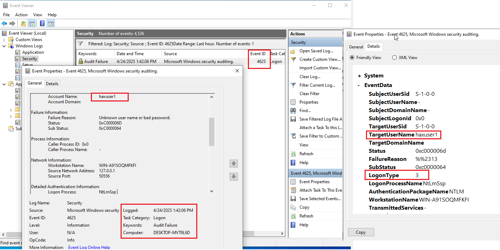

# 🛡️ Day 02 – Windows Event Log Analysis: Account Logon Events

## 📌 Objective

Explore the Windows Security Event Log to detect account logon events. Understand how different Event IDs (4624, 4625, 4647, etc.) provide insight into user behavior and possible threat activity.

---

## 🛠️ Tools Used

- Windows Event Viewer (`eventvwr.msc`)
- PowerShell (`auditpol`)
- MITRE ATT&CK (T1078 – Valid Accounts)

---

## 🧪 Steps Performed

### ✅ Step 1: Enabled Audit Policies

- Launched `secpol.msc`
- Enabled the following audit policies:
  - Logon Events
  - Account Logon Events
  - Object Access

### ✅ Step 2: Simulated Account Activity

- Logged in and out as local test user
- Triggered failed login (wrong password)
- Used PowerShell to verify enabled audit policies:
  ```powershell
  auditpol /get /category:*


### ✅ Step 3: Analyzed Logs in Event Viewer
- Opened: Event Viewer → Windows Logs → Security

- Filtered for:

  - 4624 – Successful logon

  - 4625 – Failed logon

  - 4647 – User-initiated logoff

- Reviewed fields:

  - Logon Type

  - Subject Username

  - Source Network Address

---

## 📸 Screenshot
<p align="center">
  
</p>

---

## 🧠 Key Learnings
- Event IDs are crucial for correlating login behavior with suspicious activity

- Logon Type 10 = RDP login, Logon Type 3 = Network, etc.
 
- Filtering event logs helps quickly triage brute force attempts

---

## 🎯 Conclusion
Logon Event IDs form the backbone of Windows-based threat detection. This lab reinforced how to simulate, collect, and interpret account-related activity as a SOC analyst.