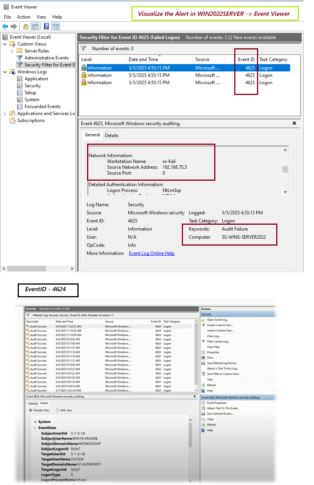

# 🛡️ Day 03 – Advanced Windows Log Filtering & Event Correlation

## 📌 Objective

Use Event Viewer’s filtering and XML query capabilities to detect correlated event patterns, such as multiple failed logins followed by a successful one. Learn to pivot across Event IDs and logon types to spot anomalies.

---

## 🛠️ Tools Used

- Windows Event Viewer
- Event ID Reference List
- MITRE ATT&CK: [T1110 – Brute Force](https://attack.mitre.org/techniques/T1110/)

---

## 🧪 Steps Performed

### ✅ Step 1: Simulated a Brute Force Pattern

- Triggered 3 failed login attempts (wrong password)
- Followed by a successful login with correct credentials
- Captured event logs during this activity

### ✅ Step 2: Filtered for Specific Event IDs

Used `Event Viewer → Security Log → Filter Current Log` with:
- **4625** – Failed login
- **4624** – Successful login
- **4648** – Logon with explicit credentials

Also used **XML filtering** for multi-ID logic.

### ✅ Step 3: Correlated Logon Types and Timestamps

- Observed a burst of `4625` followed closely by `4624`
- Matched `TargetUserName`, `Logon Type`, and `Source Network Address`

---

## 📸 Screenshot

  

---

## 🧠 Key Learnings

- Windows Security Logs can expose lateral movement and brute force indicators
- XML filtering allows for advanced, time-based correlation in Event Viewer
- Logon Type, IP, and username patterns tell a powerful story

---

## 🎯 Conclusion

This lab demonstrated how simple filters can uncover complex threat patterns. Event correlation is a key skill for SOC analysts — especially in environments without advanced SIEMs.