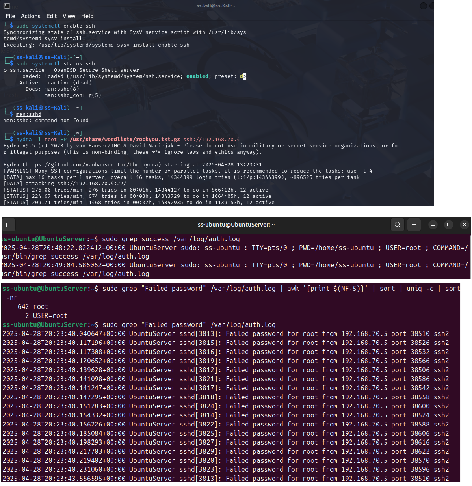

# 🛡️ Day 01 – [Lab Title Placeholder]

## 📌 Objective
The objective of this lab is to simulate an SSH brute force attack and demonstrate how to detect it using Linux authentication logs. Students will learn how to identify multiple failed logins attempts and analyze patterns to uncover brute force activity.

---

## 🛠️ Lab Setup: System Requirements
- Attacker Machine: Kali Linux (or any Linux with hydra)
-	Target Machine: Ubuntu Linux Server

## 🛠️ Tools Used
- hydra (on attacker machine)
-	openssh-server (on target machine)
-	rsyslog (default logging service)

## Log Files
•	/var/log/auth.log – Authentication logs (Ubuntu/Debian)
•	/var/log/secure – (CentOS/RHEL)

---

## 🧪 Steps Performed

⚔️ Step 1: Attack Simulation – Brute Force SSH using Hydra
⚠️ Only perform on authorized systems you own or control.

On the Attacker Machine:
< hydra -l root -P /usr/share/wordlists/rockyou.txt ssh://TARGET-IP >

This will attempt multiple passwords guesses for user root on the SSH port.
Ensure SSH is enabled on the target:
< sudo systemctl status ssh >

🔍 Step 2: Detection and Analysis – Analyze Auth Logs
Check for failed login attempts:
sudo grep "Failed password" /var/log/auth.log

Find usernames tried:
sudo grep "Failed password" /var/log/auth.log | awk '{print $(NF-5)}' | sort | uniq -c | sort -nr

Watch live log activity:
< sudo tail -f /var/log/auth.log >

🔍 What to Look For
- 20+ failed attempts from the same IP in under 5 mins
- Attempts on sensitive users (root, admin)
- Sudden success after multiple failures

---

## 📸 Screenshot

  

---

## 🧠 Key Learnings
- Multiple failed login attempts were detected from a single IP (192.168.70.4) in a short timeframe, indicating a brute force pattern.
- The root user was the primary target, confirming attackers often go after high-privilege accounts.
- One successful login was observed following a series of failures — highlighting the risk when weak or common passwords are used.
- All activities were clearly logged in /var/log/auth.log, making it an essential source for SSH-related forensics.

---

## 🎯 Conclusion
- Auth logs are vital for detecting brute force login attempts
- Multiple failures from a single IP is a strong signal of attack
- Combine log analysis with tools like fail2ban to block repeat offenders automatically
