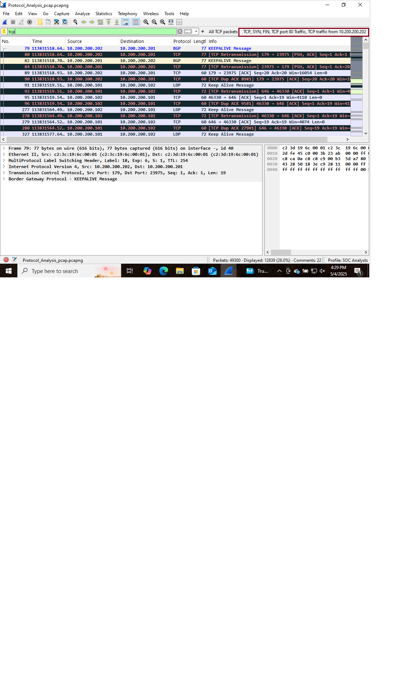
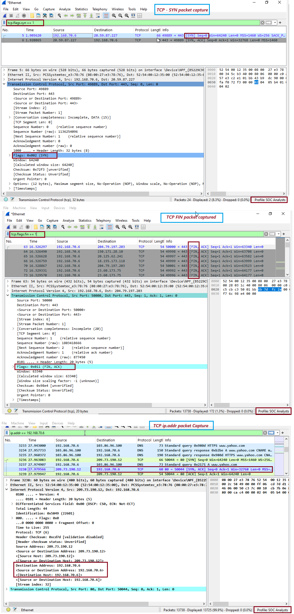

# 🛡️ Day 8 – Wireshark - TCP Protocol Analysis

## 📌 Objective
The objective of this lab is to analyze TCP (Transmission Control Protocol) traffic using Wireshark. And learn TCP establishes connections, 3-way handshake process, and interpret common TCP fields and flags

---

## 🛠️ Tools Used
- Operating System: Windows 10/11 (or Linux/macOS)
- Software: Wireshark (latest version)

📘 TCP Packet Structure and Fields
TCP is a Layer 4 (Transport Layer) protocol that ensures reliable, ordered, and error-checked delivery of data between applications.

Key TCP Fields:

| **Field Name**    | **Description**                             |
| ----------------- | ------------------------------------------- |
| Source Port       | Sender’s port number                        |
| Destination Port  | Receiver’s port number                      |
| Sequence Number   | Number of the first byte in the segment     |
| Acknowledgment No | Confirms received data                      |
| Flags             | Control bits (SYN, ACK, FIN, RST, PSH, URG) |
| Window Size       | Buffer size available                       |
| Checksum          | Error-checking field                        |

🔍 Most Common TCP Display Filters (Wireshark)
| **Filter**               | **Description**                        |
| ------------------------ | -------------------------------------- |
| `tcp`                    | Show all TCP packets                   |
| `tcp.flags.syn == 1`     | Show SYN packets (start of connection) |
| `tcp.flags.fin == 1`     | Show FIN packets (end of connection)   |
| `tcp.port == 80`         | Show TCP packets on port 80            |
| `ip.addr == 192.168.1.1` | TCP traffic to/from a specific host    |

---

## 🧪 Steps Performed
1. Capture and filter network traffic
2. Analyze TCP traffic and filter a particular TCP on port 80 and identify 3-way handshake (SYN, SYN+ACK, ACK)

---

## 📸 Screenshot

  
  

---

## 🧠 Key Learnings
- TCP (Transmission Control Protocol) operates at the Transport Layer (Layer 4) and ensures reliable, ordered, and error-checked delivery of data between applications. 
- Each TCP packet contains fields like Source and Destination Ports, Sequence and Acknowledgment Numbers, Flags (e.g., SYN, ACK, FIN), Window Size, and a Checksum for error detection.
- In Wireshark, useful display filters include tcp for all TCP traffic, tcp.flags.syn == 1 for connection starts, tcp.flags.fin == 1 for connection ends, and tcp.port == 80 or ip.addr == x.x.x.x to filter by port or host.
- Understanding TCP flags and filters is critical for tracking connection states, troubleshooting, and identifying malicious behavior like port scans or RST floods.

---

## 🎯 Conclusion
- TCP ensures reliable and ordered data delivery through its 3-way handshake and flow control.
- Understanding TCP flags is essential for:
- Connection state tracking
- Troubleshooting dropped or reset connections
- Detecting scanning and abnormal behavior (e.g., RST floods)
