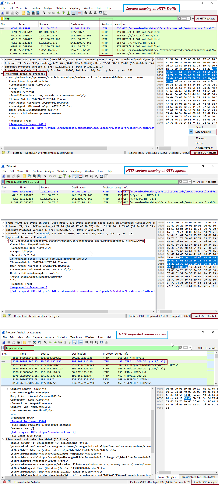

# 🛡️ Day 9 – Wireshark - HTTP Protocol Analysis

## 📌 Objective
The objective of this lab is to analyze HTTP (Hypertext Transfer Protocol) packets using Wireshark and  filter HTTP traffic to identify GET requests and follow the stream to analyze both request and response. 

---

## 🛠️ Tools Used
- Operating System: Windows 10/11 (or Linux/macOS)
- Software: Wireshark (latest version)

📘 HTTP Packet Structure and Fields
HTTP is an application-layer protocol used for communication between clients (browsers) and web servers. It typically runs over TCP port 80.

🗂️ Key HTTP Fields
| **Field Name** | **Description**                               |
| -------------- | --------------------------------------------- |
| Request Method | `GET`, `POST`, `HEAD`, etc.                   |
| Host           | The website being accessed                    |
| User-Agent     | Information about the client/browser          |
| URI            | Resource path on the server                   |
| Status Code    | Server's response status (e.g., `200 OK`)     |
| Content-Type   | MIME type of the response (e.g., `text/html`) |
| Cookie/Header  | Session or tracking information               |

🔍 Most Common HTTP Display Filters (Wireshark)

| **Filter**                     | **Description**                    |
| ------------------------------ | ---------------------------------- |
| `http`                         | Show all HTTP traffic              |
| `tcp.port == 80`               | HTTP traffic by default port       |
| `http.request.method == "GET"` | Show all GET requests              |
| `http.request.uri`             | View requested resources           |
| `http.set_cookie`              | Show cookies in HTTP responses     |
| `ip.addr == 192.168.1.10`      | HTTP traffic to/from specific host |

---

## 🧪 Steps Performed
1. Capture HTTP traffic using Wireshark
2. Refine HTTP traffic analysis filtering using http;   http.request.method == "GET" and http.request.uri  filters

## 📸 Screenshot

  

---

## 🧠 Key Learnings
- Learned to filter and analyze HTTP packets, which helps in identifying various threats. 
- Refining HTTP traffic analysis filtering using http; http.request.method == "GET" and http.request.uri  filters.
- GET requests often contain query parameters that might reveal credentials or search queries.
- Cookies can expose session IDs if not encrypted (HTTPS missing).
- User-Agent strings can help identify bots or malware-infected clients
- Understanding HTTP packets is important for detecting data leaks, malware connections, suspicious downloads, and unauthorized access during traffic analysis. 

---

## 🎯 Conclusion
- HTTP traffic is readable and easy to analyze in Wireshark.
- Analyzing HTTP helps detect:
- Sensitive data exposure in URLs or headers
- Malware beaconing to C2 servers
- Suspicious file downloads or unauthorized access
