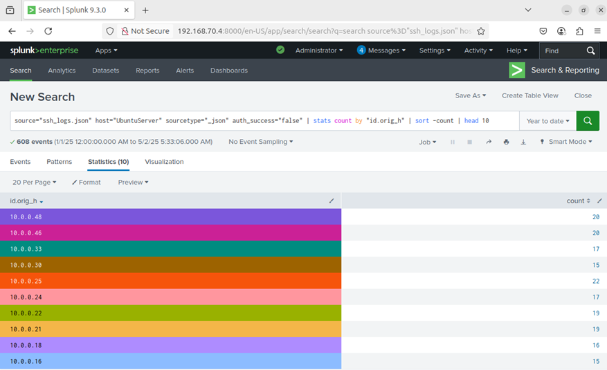
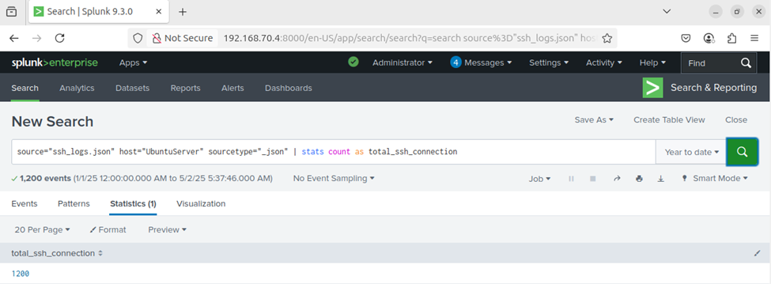
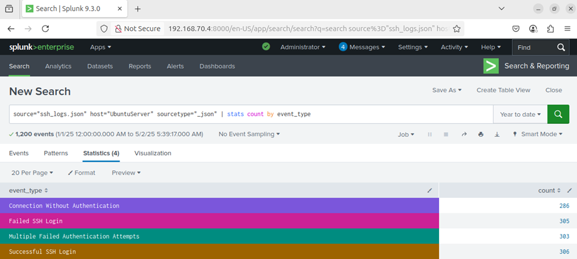

# 🛡️ Day 18 – Splunk SSH Log Analysis using Zeek logs

## Objective

In this lab, I practiced how to:
- Ingest and analyze SSH logs using Splunk
- Extract key insights such as failed login attempts, total SSH connections, and event type distribution
- Apply SPL (Search Processing Language) to investigate SSH activity and potential brute-force attacks

## 🗂️ Table of Contents
- [Objective](#objective)
- [Lab Setup](#lab-setup)
- [Steps to Upload SSH Log into Splunk](#steps-to-upload-ssh-log-into-splunk)
- [Lab Tasks](#lab-tasks---use-spl-queries-to-complete-the-following-analysis)
  - [Task 1: Top 10 Endpoints with Failed SSH Logins](#task-1-list-the-top-10-endpoints-with-failed-ssh-login-attempts)
  - [Task 2: Total SSH Connections](#task-2-find-the-number-of-total-ssh-connections)
  - [Task 3: Count All SSH Event Types](#task-3-count-all-event-types-successful-failed-no-auth-multiple-failed)
- [Key Learnings](#key-learnings)
- [Conclusion](#conclusion)

---

## Lab Setup
✅ Splunk: Already installed and accessible.
✅ Data Source: JSON-formatted Zeek-style SSH logs.
🌐 Log File: Download and upload to Splunk using the steps below.

---

## Steps to Upload SSH Log into Splunk
1. Go to Splunk Web → Settings > Add Data.
2. Choose Upload and select synthetic_zeek_ssh.json.
3. Set Source type: json or create a new one zeek:ssh.
4. Index: Choose main or create a new index like ssh_lab.
5. Finish the upload and confirm indexing.


---

## Lab Tasks - Use SPL queries to complete the following analysis:

✅Task 1: List the top 10 endpoints with failed SSH login attempts
```
 source="ssh_logs.json" host="UbuntuServer" sourcetype="_json" auth_success=false
| stats count by "id.orig_h"
| sort -count
| head 10
```

## 📸 Screenshot
<p align="center">
  
</p>


✅Task 2: Find the number of total SSH connections
```
source="ssh_logs.json" host="UbuntuServer" sourcetype="_json" | stats count as total_ssh_connections
```

## 📸 Screenshot
<p align="center">
  
</p>


✅Task 3: Count all event types (successful, failed, 
 no-auth, multiple-failed) seen in the logs
 ```
 source="ssh_logs.json" host="UbuntuServer" sourcetype="_json" | stats count by event_type
```

## 📸 Screenshot
<p align="center">
  
</p>

---

## Key Learnings
- ✅ Ingested and indexed SSH logs into Splunk using JSON format
- ✅ Built SPL queries to analyze authentication success/failure patterns
- ✅ Identified top 10 endpoints with failed SSH login attempts
- ✅ Counted total SSH connections and categorized events (e.g., success, fail, no-auth)
- ✅ Gained hands-on experience detecting brute-force or unauthorized access attempts


---

## Conclusion
This lab focused on analyzing SSH logs using Splunk’s SPL queries. I learned how to detect failed and successful authentication attempts, identify high-risk endpoints, and classify event types to uncover potential brute-force attacks. These skills are essential for threat hunting and incident response within SOC environments.

<details>
<summary>💡 Pro Tip: Enrich SSH Data in Splunk</summary>

- Use field aliases or `eval` to normalize IP fields (e.g., `src_ip`, `dest_ip`)
- Combine SSH logs with threat intel feeds for IP reputation lookups
- Set alerts for high failed login counts or unusual SSH ports
- Use Splunk visualizations to track brute-force patterns over time

</details>
