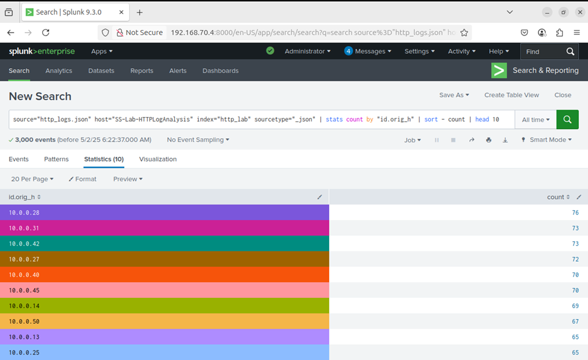
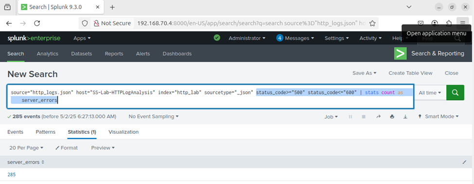
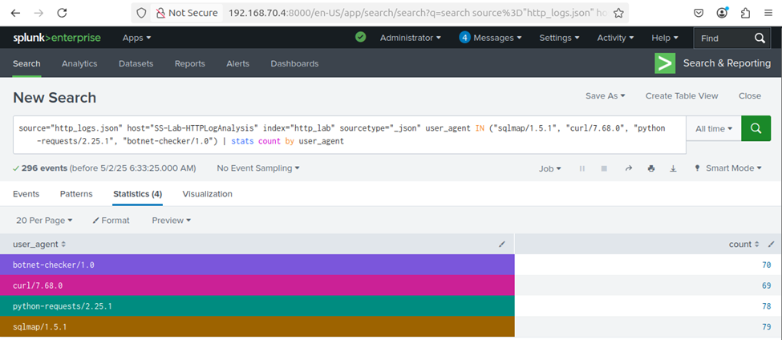

# 🛡️ Day 19 – Splunk HTTP Log Analysis Using Zeek Logs

## Objective
In this lab, you will:
- Ingest and analyze HTTP logs using Splunk.
- Detect client/server errors and potential scripted activity.
- Identify large file transfers and unusual web access patterns using SPL.

## 🗂️ Table of Contents
- [Objective](#objective)
- [Lab Setup](#lab-setup)
- [Steps to Upload HTTP Log into Splunk](#steps-to-upload-http-log-into-splunk)
- [Lab Tasks](#lab-tasks-use-spl-queries-to-complete-the-following-analysis)
  - [Task 1: Top 10 Endpoints](#task-1-find-the-top-10-endpoints-generating-web-traffic)
  - [Task 2: Count Server Errors](#task-2-count-the-number-of-server-errors-5xx-observed)
  - [Task 3: Identify Suspicious User-Agents](#task-3-identify-user-agents-associated-with-possible-scripted-attacks)
  - [Task 4: Find Large File Transfers](#task-4-find-large-file-transfers-greater-than-500-kb)
- [Key Learnings](#key-learnings)
- [Conclusion](#conclusion)

---

## Lab Setup
- ✅ Splunk: Already installed and accessible.
- ✅ Data Source: JSON-formatted Zeek-style HTTP logs.
- 🌐 Log File: Download and upload to Splunk using the steps below.

---

## Steps to Upload HTTP Log into Splunk
1. Go to Splunk Web → Settings > Add Data.
2. Choose Upload and select synthetic_zeek_http.json.
3. Set Source type: json or create a new one zeek:http.
4. Index: Choose main or create a new index like http_lab.
5. Finish the upload and confirm indexing.

---

## Lab Tasks: Use SPL queries to complete the following analysis:

### Task 1: Find the top 10 endpoints generating web traffic
```
source="http_logs.json" host="SS-Lab-HTTPLogAnalysis" index="http_lab" sourcetype="_json" 
| stats count by "id.orig_h"
| sort -count
| head 10
```

### 📸 Screenshot - Top 10 Endpoints generating Web Traffic
<p align="center">
  
</p>


### Task 2: Count the number of server errors (5xx) observed
```
source="http_logs.json" host="SS-Lab-HTTPLogAnalysis" index="http_lab" sourcetype="_json"
status_code>="500" status_code<="600"
| stats count as server_errors
```

### 📸 Screenshot - Count the number of Server error
<p align="center">
  
</p>


### Task 3: Identify User-Agents associated with possible scripted attacks
```
source="http_logs.json" host="SS-Lab-HTTPLogAnalysis" index=http_lab sourcetype="json" user_agent IN ("sqlmap/1.5.1", "curl/7.68.0", "python-requests/2.25.1", "botnet-checker/1.0")
| stats count by user_agent
```

### 📸 Screenshot - User-Agents associated with possible scripted attacks
<p align="center">
  
</p>

### Task 4: Find large file transfers (greater than 500 KB)
```
source="http_logs.json" host="SS-Lab-HTTPLogAnalysis" index=http_lab sourcetype="json" resp_body_len>500000
| table ts "id.orig_h" "id.resp_h" uri resp_body_len
| sort -resp_body_len
```

### 📸 Screenshot - Large file transfers 
<p align="center">
  
</p>

---

## Key Learnings

- ✅ Ingested JSON-formatted HTTP logs into Splunk
- ✅ Analyzed traffic using SPL to identify top endpoints
- ✅ Detected HTTP error responses (5xx) and suspicious user agents
- ✅ Identified large HTTP responses indicating potential file exfiltration


---

## Conclusion
This lab demonstrated how Splunk can be used to analyze HTTP logs for common security use cases such as detecting server errors, suspicious user agents, and large file transfers. These techniques are crucial in identifying reconnaissance activity, brute-force attempts, or potential data exfiltration. Practicing these SPL-driven analyses helps reinforce Splunk’s role in log centralization, real-time monitoring, and incident response.

<details>
<summary>💡 Pro Tip: Extend Your HTTP Log Analysis</summary>

- Combine HTTP logs with DNS or proxy logs for deeper context  
- Use `eval` to extract URI patterns or file extensions  
- Set alerts on specific user agents (e.g., `sqlmap`, `curl`)  
- Build dashboards to visualize top error trends and file transfers

</details>
