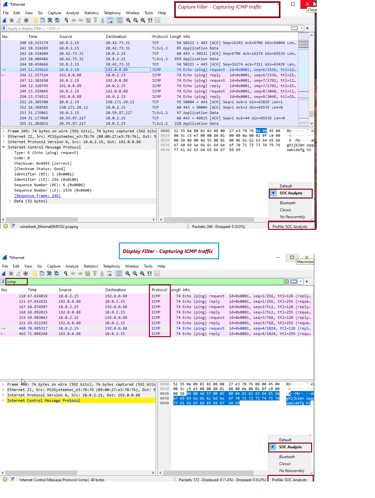

# 🛡️ Day 6 – Understanding Wireshark tool - Packet Filtering and Profile creations 

## 📌 Objective
The objective of this lab is show how SOC analysts use Wireshark, a powerful packet analysis tool used to investigate network traffic. I learned how to capture packets from Interfacce, apply filters, and identify suspicious communication patterns.

---

## 🛠️ Lab Setup - System Requirements

- Operating System: Windows, Linux, or macOS
- Network Adapter: Required for packet capture

## Software (Tool) Required

- Wireeshark (latest stable version)

📘 What is Wireshark?
Wireshark is an open-source network protocol analyzer that lets you capture and interactively browse network traffic. It allows analysts to view data packets flowing in and out of a system in real time or from saved PCAP files.

🛡️ Wireshark Use Cases for SOC Analysts
🔍 Incident Investigation: Analyze malicious traffic patterns (e.g., C2 communication, lateral movement)
🕵️ Malware Analysis: Extract indicators like domains, IPs, and payloads from suspicious network behavior
🚨 Threat Hunting: Detect anomalies like DNS tunneling, beaconing, or unauthorized FTP/SSH usage
🛠️ Protocol Troubleshooting: Identify service failures, misconfigurations, or latency issues

---

## Steps Taken
⚔️ Step 1: Create SOC Analyst Profile
⚔️ Step 2: Search ICMP using Display Filter
⚔️ Step 3:- Search ICP using Capture Filter

## 📸 Screenshot

  

---

## 🧠 Key Learnings
- ICMP traffic is easy to isolate using both capture and display filters.
Wireshark provides real-time insight into packet-level network activity.
Creating a custom profile (SOC Analyst) helps segment use-cases and preferred layouts.
- How does this relate to MITRE ATT&CK or real-world SOC tasks?
Display filters are non-destructive and flexible—useful for forensic investigations.
Capture filters are faster and reduce noise—but cannot be changed mid-capture.
---

## 🎯 Conclusion
Analyzed ICMP echo requests/replies protocol, a foundation for understanding more advanced protocols like TCP and DNS.
