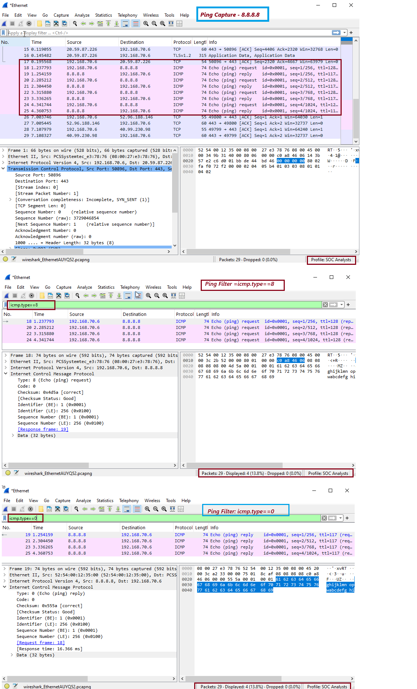

# 🛡️ Day 7 – [Lab Title Placeholder]

## 📌 Objective
> The object of this lab is to understand and analyze ICMP (Internet Control Message Protocol) packets using Wireshark, which primarily consists of ping messages used for troubleshooting and identify ICMP Echo Requests and Echo Replies, interpret ICMP packet fields and apply relevant filters for investigation network connectivity. 

---

## 🛠️ Tools Used
- Operating System: Windows 10/11 (or Linux/macOS)
- Software: Wireshark (latest version)

📘 ICMP Packet Structure and Fields
ICMP is a Layer 3 protocol used for sending error messages and operational information. The most common ICMP messages include Echo Request (Type 8) and Echo Reply (Type 0).

📘Key ICMP Fields:
| **Field Name** | **Description**                      |
| -------------- | ------------------------------------ |
| Type           | Defines the ICMP message type        |
| Code           | Provides further detail for the type |
| Checksum       | Error-checking for header            |
| Identifier     | Helps match requests and replies     |
| Sequence No.   | Sequence of the request/reply        |
| Data           | Optional payload                     |

🔍 Most Common ICMP Display Filters
Use these filters in Wireshark’s Display Filter bar:

| **Filter**                | **Description**                    |
| ------------------------- | ---------------------------------- |
| `icmp`                    | Show all ICMP traffic              |
| `icmp.type == 8`          | Show Echo Requests (ping)          |
| `icmp.type == 0`          | Show Echo Replies                  |
| `icmp.code == 3`          | Destination unreachable            |
| `ip.addr == 192.168.1.10` | ICMP traffic from/to specific host |

---

## 🧪 Steps Performed
1. Capture and filter network traffic
2. Analyze common protocols
3. Identify anomalies that indicate security incidents

---

## 📸 Screenshot

  

---

## 🧠 Key Learnings - ICMP Analysis
- ICMP is essential for network diagnostics (e.g., ping, traceroute).,
- Identified Echo Request(Type8) / Echo Reply (Type 0) and noticed that each reply had a matching Identifier and Sequence Number to its corresponding request
- Echo Request/Reply is useful for confirming reachability and measuring latency.
- Wireshark simplifies ICMP analysis through protocol-aware filtering.,
- Understanding ICMP also helps detect reconnaissance (e.g., ping sweeps or scans).

---

## 🎯 Conclusion
-	ICMP is a fundamental protocol for network troubleshooting.
-	Wireshark helps visualize ICMP packet flow and structure.
-	Understanding ICMP helps detect network scanning, ping sweeps, and unreachable hosts.

