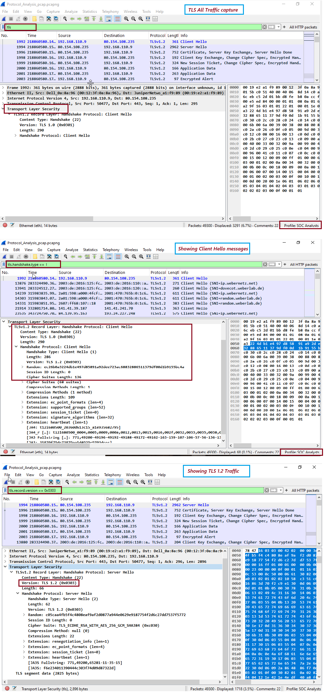

# 🛡️ Day 10 – Wireshark - TLS Protocol Analysis

## 📌 Objective
The objective of this lab is to analyze TLS (Transport Layer Security) traffic using Wireshark and explore how TLS secures data over the network, understand handshake messages, and identify metadata like server names and certificate details.

TLS (Transport Layer Security) is a cryptographic protocol that provides secure communication over the internet. It runs over TCP, commonly on port 443, and is used in HTTPS, FTPS, SMTPS, etc.

🗂️ Key TLS Handshake Messages:
| **Message Type** | **Description**                                          |
| ---------------- | -------------------------------------------------------- |
| Client Hello     | Client initiates secure connection, offers cipher suites |
| Server Hello     | Server selects cipher and provides certificate           |
| Certificate      | Server provides digital certificate (X.509)              |
| Key Exchange     | Client and server exchange keys for session              |
| Finished         | Secure session begins                                    |

🔍 Most Common TLS Display Filters

| **Filter**                     | **Description**       |
| ------------------------------ | --------------------- |
| `tls`                          | Show all TLS traffic  |
| `tcp.port == 443`              | TLS over HTTPS        |
| `tls.handshake.type == 1`      | Client Hello messages |
| `tls.handshake.type == 2`      | Server Hello messages |
| `tls.record.version == 0x0303` | TLS 1.2 traffic       |
| `tls.record.version == 0x0304` | TLS 1.3 traffic       |

---

## 🛠️ Tools Used
- Operating System: Windows 10/11 (or Linux/macOS)
- Software: Wireshark (latest version)

---

## 🧪 Steps Performed
1. Capture TLS-encrypted traffic using Wireshark
2. Analyze the TLS traffic with special filter commands in wireshark tool to Show all TLS traffice, Client Hello message and TLS 1.2 traffic

---

## 📸 Screenshot

  

---

## 🧠 Key Learnings
- TLS (Transport Layer Security) is a Layer 7 encryption protocol that secures communication over the internet, commonly running over TCP port 443 (e.g., in HTTPS).
- During the TLS handshake, the client and server exchange messages like Client Hello, Server Hello, Certificates, and Key Exchange to establish a secure session.
- In Wireshark, filters like tls, tls.handshake.type == 1, and tls.record.version == 0x0303 help inspect TLS traffic. While the content is encrypted, TLS metadata such as SNI (Server Name Indication), TLS version, and certificate details remains visible and useful for detecting: Outdated versions (e.g., TLS 1.0),
- Self-signed or suspicious certificates, and Malicious encrypted traffic

---

## 🎯 Conclusion
- TLS secures communication using encryption, making traffic unreadable without keys.
- Wireshark can't decrypt TLS by default but can reveal:
- Server name (SNI)
- Certificate chain
- TLS versions and cipher suites
- Analyzing TLS metadata helps detect:
- Outdated TLS versions (e.g., TLS 1.0)
- Suspicious or self-signed certificates
- Malicious domain encryption abuse