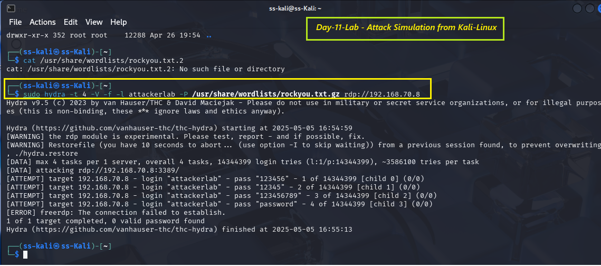
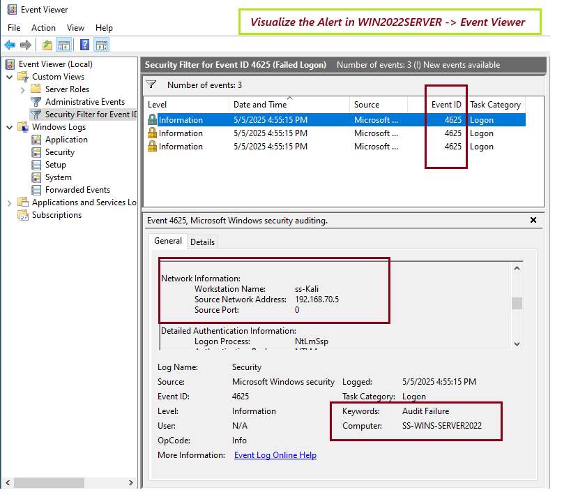

# 🛡️ Day 11 – Introduction to Incident Response - Windows RDP Brute Force Detection

## 📌 Objective
This lab helped me understand the fundamentals of incident response and practice real-world detection techniques using Windows Event Viewer. I simulated an RDP brute-force attack using Kali Linux and observed how these events are logged and mitigated on a Windows Server.

---

## 🧠 What is Incident Response?
**Incident Response (IR)** is the structured process used by security teams to detect, contain, investigate, and recover from security threats. It helps ensure minimal damage and fast recovery after a security breach.

---

## 🔄 Incident Response Lifecycle (NIST SP 800-61 Rev. 2)

| **Phase**                         | **Description**                                                                 |
|----------------------------------|---------------------------------------------------------------------------------|
| 1. Preparation                   | Define policies, train teams, and configure monitoring/logging tools            |
| 2. Detection and Analysis        | Identify incidents using logs, alerts, and behavioral analysis                  |
| 3. Containment, Eradication, Recovery | Isolate systems, remove threats, and restore normal operations           |
| 4. Post-Incident Activity        | Document findings, report lessons learned, and update response strategies       |

---
```
<details>
<summary> 💥 Common Windows Security Incidents</summary>

| **Incident Type**        | **Description**                                                        |
|-------------------------------------|------------------------------------------------------------------------------|
| Unauthorized Login Attempts         | Repeated or brute-force RDP/local logins                                     |
| PowerShell-Based Attacks            | Obfuscated/encoded PowerShell commands for exploitation                      |
| Malware or Ransomware Execution     | Executable payloads causing system compromise or encryption                  |
| Credential Dumping                  | Use of tools like Mimikatz to extract credentials                            |
| Lateral Movement                    | Accessing internal machines via WMI, RDP, or SMB                              |

---
</details>
```
-----

## 🧪 Lab Task – Simulate and Detect RDP Brute Force

### 🖥️ Lab Setup
- **Target**: Windows Server 2022 (RDP Enabled) - [WIN2022SERVER - 192.168.70.8]
- **Attacker**: Kali Linux with Hydra [ss-Kali - 192.168.70.5]
- **Tools**: Event Viewer, Windows Firewall, Nmap

### ✅ Preparation (on Windows Server)
1. Enable **RDP** in System Properties.
2. Allow **Remote Desktop** through Firewall.
3. Create a test user:
   ```powershell
   net user attackerlab Password123 /add 
   ```
4. Open Event Viewer and filter for Event ID **4625**

🚨 Attack Simulation (on Kali Linux)
```
sudo hydra -t 4 -V -f -l attackerlab -P /usr/share/wordlists/rockyou.txt rdp://192.168.70.8
```

- Monitor resulting login failures on Windows

## 📸 Screenshot - Attack Simulation from Kali
<p align="center">
  
</p>


👁️ Detection via Event Viewer
- Logon Type: 10 (RDP/RemoteInteractive)
- Failure Reason: Unknown username or bad password
- Event ID: 4625
- Source IP: 192.168.70.5 of Kali Attacker

## 📸 Screenshot - Detection via Event Viewer
<p align="center">
  
</p>

---

🛡️ Response Steps
1. Correlate Events: Multiple 4625 failures from one IP

2. Block Attacker IP:

``` powershell
 New-NetFirewallRule -DisplayName "Block Attacker" -Direction Inbound -RemoteAddress <192.168.70.5 > - Action Block ```

3. Validate Rule via Windows Firewall and re-run Hydra

4. Check Logs to confirm traffic is dropped

## 📸 Screenshot - Firewall Rules (Windows Server), Blocked rule confirmation (on Kali-Linux), MS Windows Firewall logs

<p align="center">
  
</p>

```markdown
## 🧠 Key Learnings
✅ This lab reinforced the following concepts:

- [x] Simulating an RDP brute-force attack using Hydra
- [x] Detecting login failures through Windows Event Viewer
- [x] Blocking malicious IPs with Windows Firewall
- [x] Applying core steps of the incident response lifecycle
```
---

📁 Evidence Collected
- Hydra attack output from Kali
- Event Viewer logs (Event ID 4625)
- Firewall rule screenshot
