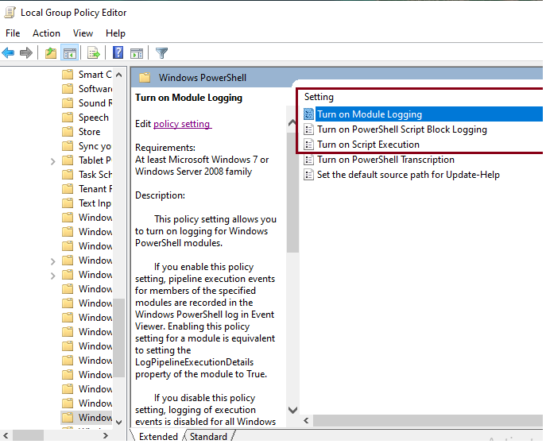
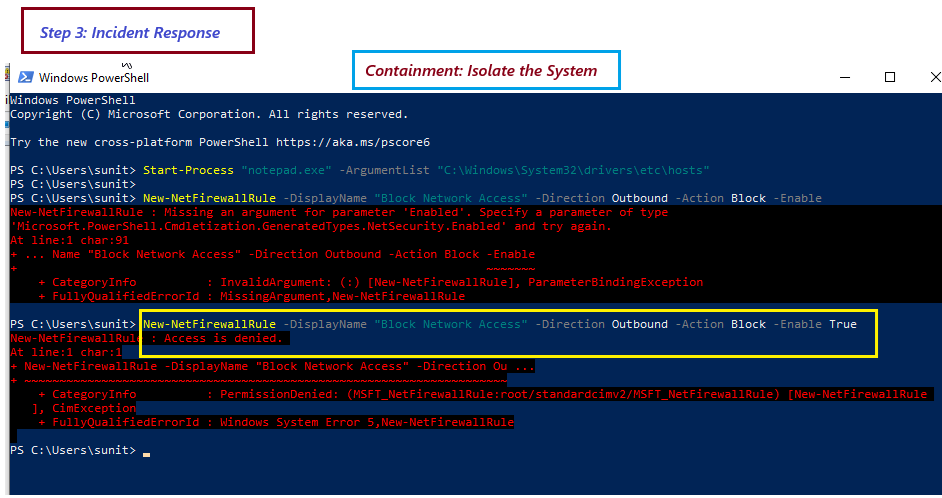
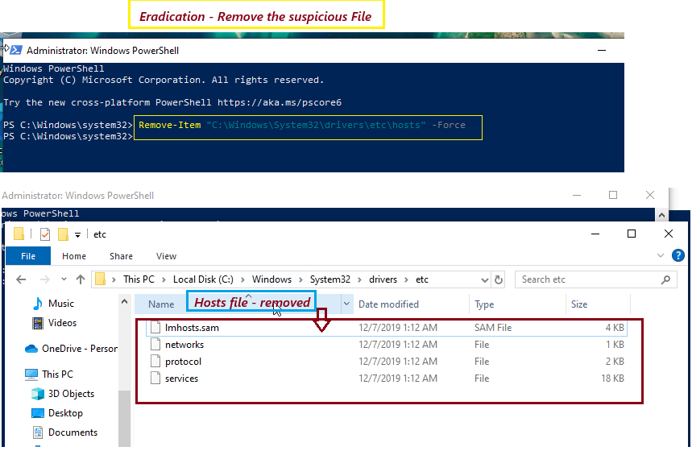
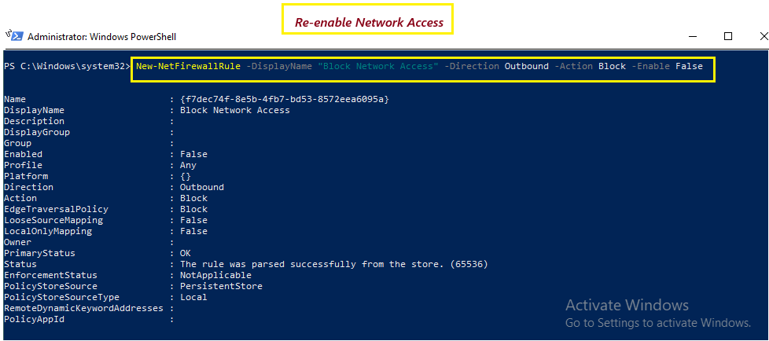
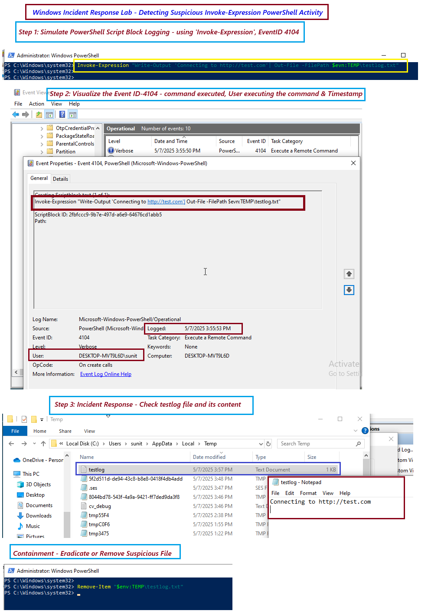

# 🛡️ Day 14 – Detecting Suspicious PowerShell Activity – Windows Incident Response Lab

## 📌 Objective
Simulate and investigate a suspicious PowerShell command on a Windows system to learn how to detect PowerShell-based threats using built-in logs, analyze activity using Event Viewer, and perform basic incident response actions.

---

## 🗂️ Table of Contents
- [Objective](#-objective)
- [Why PowerShell Matters](#why-powershell-matters-in-incident-response)
- [Incident Response Process](#incident-response-process-nist-sp-800-61-rev-2)
- [Lab Setup](#-lab-setup)
- [Preparation](#preparation)
- [Steps Performed](#-steps-performed-explore-and-analyze-windows-powershell-logs)
- [Reporting Summary](#-reporting-summary)
- [Key Learnings](#-key-learnings)
- [Conclusion](#-conclusion)

---

📘 Why PowerShell Matters in Incident Response
PowerShell is a powerful tool for system administration — but it’s also commonly used by attackers to download malware, move laterally, and execute hidden scripts. Proper logging and monitoring can help detect abuse.

🔁 Incident Response Process (NIST SP 800-61 Rev. 2)

| **Phase**                       | **Description**                    |
|----------------------------------|--------------------------------------------------|
| Preparation                 | Ensure PowerShell logging and security auditing is in place      |
| Detection and Analysis      | Investigate PowerShell misuse via logs and alerts      |
| Containment, Eradication, Recovery | Kill malicious processes, restore changes, remove malicious files    |
| Post-Incident Activity      | Document the incident, adjust monitoring and prevention measures     |


---

### ⚠️ Scenario: Suspicious PowerShell Command Executed

A user accidentally ran a PowerShell command that simulates suspicious behavior — like contacting a remote server and writing data to disk. You must detect and analyze this command through system logs.

---

## 🛠️ Lab Setup 

### Requirements:
- **System**: Windows 10/11 or Windows Server 2019/2022
- **Tools**:
    - Windows Event Viewer (pre-installed)
    - PowerShell (Pre-installed on Windows)
    - Administrative Privileges (required for enabling logs)

---

### Preparation:

Before proceeding, make sure PowerShell script block logging is enabled on your system:

1. Press 'Win + R', type 'gpedit.msc', and press Enter to open the Group Policy Editor.
2. Navigate to: 'Computer Configuration' > 'Administrative Templates' > 'Windows Components' > 'Windows PowerShell'
3. Turn on **Module Logging**, **Script Block Logging**, and **Script Execution**.
4. Apply the settings and close the Group Policy Editor.


### 📸 Screenshot - Windows PowerShell Module Logging-Enabled
<p align="center">
  
</p>
<p align="center"><em>Windows PowerShell Module Logging Enabled</em></p>

---

## What are Windows PowerShell Logs?
PowerShell logs contain information about PowerShell script executions, including details about the commands that were run, the processes that invoked them, and the user who executed them. These logs can be used to detect potential misuse of PowerShell, including post-exploitation techniques often used by attackers.

### Key PowerShell Logs to Monitor:
- Event ID 4104: Script block logging, capturing the PowerShell commands executed.
- Event ID 4103: Command invocation with parameter binding (detailed command execution).
- Event ID 4698: PowerShell Module Logging for the execution of specific modules.
- Event ID 4101: Execution of PowerShell commands through command-line arguments.

## 🧪 Lab Task: Explore and Analyze Windows PowerShell logs 

### Step 1: Generate PowerShell logs
1. Open PowerShell as Administrator.
2. Run the following PowerShell command to generate a log entry:
```
Start-Process "notepad.exe" -ArgumentList "C:\Windows\System32\drivers\etc\hosts"
```
This command
  - Starts a new process using the Start-Process cmdlet.
  - Specifies "notepad.exe" as the program to launch.
  - Passes "C:\Windows\System32\drivers\etc\hosts" as an argument to Notepad.
  - As a result, Notepad opens the hosts file directly.

### Step 2: Visualize the events
1. After running the command, go back to Event Viewer and navigate to:
```
Applications and Services Logs → Microsoft → Windows → PowerShell → Operational
```
2. Look for Event ID 4103 in the logs (this will show script block logging for the PowerShell command you executed).
3. Take a screenshot of the event details, including:
  - PowerShell command that was executed
  - User who ran the command
  - Timestamp of the execution

### Step 3. Incident Response
 1.  Check the file and it content
 ``` 
 C:\Windows\System32\drivers\etc\hosts
```
2. Containment: Isolate the system: If you suspect malicious activity, you can block network connections: Note: Usually this is doen from EDR tool.
``` 
New-NetFirewallRule -DisplayName "Block Network Access" -Direction Outbound -Action Block -Enable
```

### 📸 Screenshot - Incident Response - Containment
<p align="center">
  
</p>
<p align="center"><em>Containment: Isolate the System</em></p>

---

3. Eradication: Restore the Hosts File: If modifications to the hosts file were made without authorization, restore it from a backup:
``` 
Copy-Item "C:\Backup\hosts" -Destination "C:\Windows\System32\drivers\etc\hosts" -Force
```
Remove Suspicious Files: If you find any suspicious files related to the incident, you can remove them:
``` 
Remove-Item "C:\Path\To\SuspiciousFile.exe" -Force
```

### 📸 Screenshot - Incident Response - Eradication
<p align="center">
  
</p>
<p align="center"><em>Eradicate: Remove the Suspicious File</em></p>

---

4. Recovery: Restore from Backup (if necessary): Restore the system to a clean state from backups:
``` 
Restore-Computer -RestorePoint 1  # Restores to the first available restore point
```

Re-enable Network Access: After securing the system, re-enable network access by disabling the firewall rule:
``` 
Set-NetFirewallRule -DisplayName "Block Network Access" -Enabled False
```
### 📸 Screenshot - Incident Response - Recovery
<p align="center">
  
</p>
<p align="center"><em>Restore: Re-enable Network Access</em></p>


5. Reporting Summary

- Simulated suspicious PowerShell activity using `Invoke-Expression` (obfuscated technique)
- Detected via:
  - Event ID 4104 (Script Block Logging)
  - Sysmon Event ID 1 (Process Create) and 13/15 (File Create/Write)
- Contained and removed suspicious file:  
  `C:\Users\YourName\AppData\Local\Temp\testlog.txt`
- Suggested proactive prevention:
  - Enable Constrained Language Mode
  - Use AppLocker to limit PowerShell usage for unprivileged users 

### 📸 Screenshot - PowerShell Script Block Logging using 'Invoke-Expression', EventID 4104
<p align="center">
  
</p>
<p align="center"><em>Detecting Suspicious Invok-Expression Powershell Activity</em></p>

---

## 🧠 Key Learnings
- Learned about a critical PowerShell Script Block Logging (eventID 4104) for obfuscated or hidden command execution, Event Viewer's full forensic insight details (command executed, user who executed the command, timestamp of execution). And learned how to perform Incident Response for the Windows Powershell. 

---

## ✅ Conclusion
This lab reinforced each phase of the NIST Incident Response Lifecycle as:
- During **Preparation**, PowerShell logging was enabled. 
- In **Detection and Analysis**, suspicious use of Invoke-Expression was identified using Event ID 4104. 
- Through **Containment and Eradication**, the system was isolated, and the malicious payload removed. 
- Finally, in **Post-Incident Activity**, I reviewed artifacts, restored normal operations, and documented lessons learned. 
- This hands-on experience emphasized the importance of continuous monitoring, PowerShell visibility, and structured response for endpoint threats.

---

## ✨ Optional Enhancements
<details>
<summary>💡 <strong>📘Pro Tip: Prevent PowerShell Misuse</strong></summary>

- Use **Constrained Language Mode** to limit PowerShell to basic functionality
- Implement **AppLocker** or **Software Restriction Policies** to restrict PowerShell usage
- Use **Sysmon** + SIEM to detect `Invoke-Expression`, base64 encoding, and encoded scripts
- Alert on **event ID 4104**, **4103**, and **4101** for deeper forensic analysis

</details>
