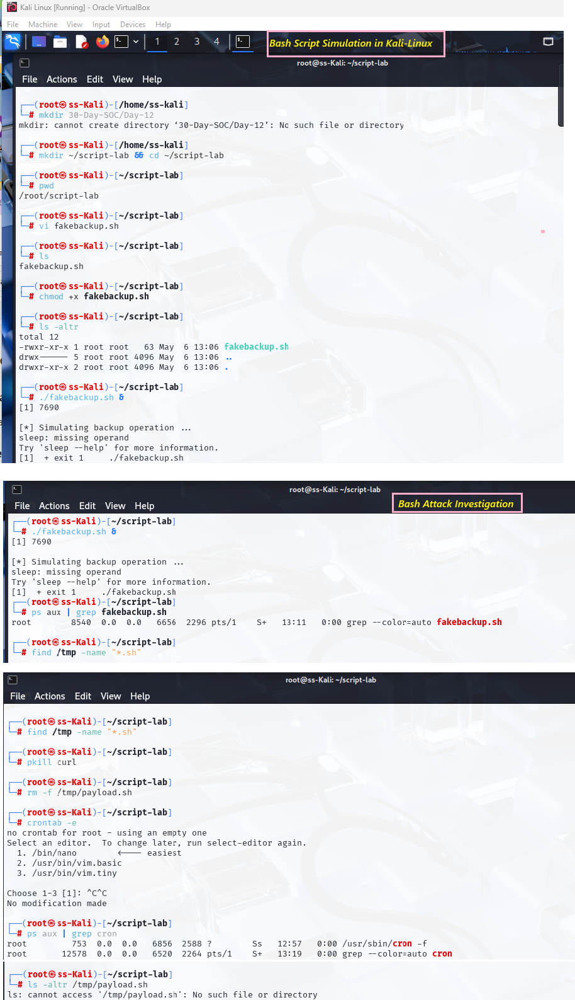

# 🛡️ Day 15 – Incident Response - Suspicious Network Connection

## 📌 Objective
Investigate and respond to a suspicious outbound network connection from a Linux machine. This simulates beaconing behavior or data exfiltration. Students will learn to inspect open connections, trace source processes, and mitigate threats.

---

## 📘 Why It Matters
Attackers often use hidden outbound connections to communicate with command-and-control (C2) servers. Detecting and cutting off these connections is essential for SOC and IR teams.

## 🔁 Incident Response Process (NIST SP 800-61 Rev. 2)
| **Phase**                       | **Description**                       |
|--------------------|-----------------------------------------|
| Preparation    | Ensure 'netstat', 'ss', and 'lsof' are installed. Enable auditd/network logging. |
| Detection and Analysis | Identify unexpected remote connections and associated processes.    |
| Containment, Eradication, Recovery | Kill the process, investigate binary, block destination IP     |
| Post-Incident Activity | Document  findings, improve firewall rules, configure monitoring tools. |

###⚠️ Scenario: Unexpected Outbound Connection Detected
A Linux system shows an active connection to an unknown IP 45.13.220.98:443, not related to any known services.


## 🛠️ Lab Setup 

### System Requirements
- Ubuntu/Kali Linux system
- Internet access
- Tools: curl, netstat or ss, lsof

Simulate Suspicious Connection
```
nohup bash -c 'while true; do curl http://45.13.220.98/ping >/dev/null 2>&1; sleep 30; done' &
```
### 📸 Screenshot – Bash Script Investigation
<p align="center">
  
</p>
<p align="center"><em>Script identified and terminated in Linux environment</em></p>

## 🧪 Steps-by-Step Investigation

###  Step 1: Detect Active Network Connections
```
netstat -plant
# or
ss -plant
```
Look for a suspicious IP such as 45.13.220.98:443.

Here -p Show the PID and program name of the connection -l Show only listening sockets -a Show all connections and listening ports -n Show numeric addresses (don’t resolve hostnames or port names) -t Show only TCP connections

### 📸 Screenshot – Detect Active Network Connections
<p align="center">
  
</p>
<p align="center"><em>Active Network Connection</em></p>

### Step 2: Identify the Responsible Process
Get the PID from netstat or ss output

Investigate:
```
ps aux | grep 45.13.220.98
```

### 📸 Screenshot – Identify the Responsible Process
<p align="center">
  
</p>
<p align="center"><em>Identify Responsible Process</em></p>

### Step 3: Containment & Eradication
- Kill the process:
```
kill <PID>
# or
pkill curl
```
- Block the IP using UFW:
```
ufw deny out to 45.13.220.98
```

### 📸 Screenshot – Containment & Eradication
<p align="center">
  
</p>
<p align="center"><em>Containment n Eradication</em></p>

### Step 4: Post-Incident Activity

### Document:

- Analyze and investigated a suspicious outbound connection to identify the process and PID using ps, netstat
- And killed the PID to contain or eradicate the suspicious connection.
- Subsequently updated UFW rule to block any future outbound connection to the C2/IP address.
- Additionally, also simulated suspicious script into the /usr/local/bin/kupdate and investigate, analyze, kill the process and remove binaries of kupdate as part of incident response procedure.  

### 📸 Screenshot – Incident Response to suspicious Kupdate script
<p align="center">
  
</p>
<p align="center"><em>Incident Response to suspicious kupdate script</em></p>

Recommendations:

- Implement egress filtering
- Deploy IDS/IPS solutions
- Monitor outbound connections and unusual traffic

---

## 🧠 Key Learnings
- Learned how to perform suspicious outbound network connection by using nohup and save the output and error messages silently. 
- Detecting it by using netstat investigate on it and perform the necessary Incident Response process.

---

## 🎯 Conclusion
- Analyze and investigated a suspicious outbound connection to identify the process and PID using ps, netstat. And killed the PID to contain or eradicate the suspicious connection.
- Subsequently updated UFW rule to block any future outbound connection to the C2/IP address.
- Also simulated suspicious script into the /usr/local/bin/kupdate and investigate, analyze, kill the process and remove binaries of kupdate as part of incident response procedure.  
