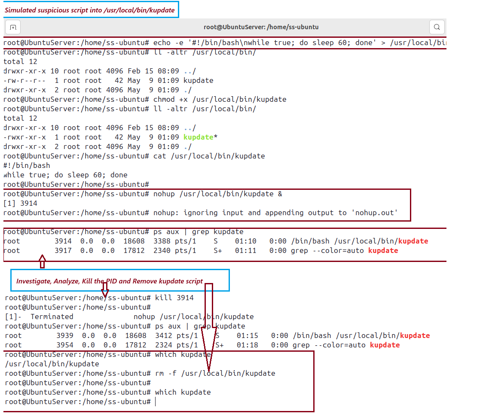

# 🛡️ Day 15 – Incident Response - Suspicious Network Connection

## 📌 Objective
Investigate and respond to a suspicious outbound network connection from a Linux machine. This simulates beaconing behavior or data exfiltration. Students will learn to inspect open connections, trace source processes, and mitigate threats.

---

🗂️ Table of Contents
- Objective
- Why This Matters
- Incident Response Process (NIST)
- Lab Setup
- Scenario
- Investigation Steps
   - Detect Suspicious Network Connection
   - Analyze the Process
   - Containment and Eradication
   - Optional: Bonus Threat – Suspicious kupdate Script
- Screenshots
- Key Learnings
- Conclusion
- Pro Tip


## 📘 Why It Matters
Attackers often use hidden outbound connections to communicate with command-and-control (C2) servers. Detecting and cutting off these connections is essential for SOC and IR teams.

## 🔁 Incident Response Process (NIST SP 800-61 Rev. 2)
| **Phase**                       | **Description**                       |
|--------------------|-----------------------------------------|
| Preparation    | Ensure 'netstat', 'ss', and 'lsof' are installed. Enable auditd/network logging. |
| Detection and Analysis | Identify unexpected remote connections and associated processes.    |
| Containment, Eradication, Recovery | Kill the process, investigate binary, block destination IP  |
| Post-Incident Activity | Document  findings, improve firewall rules, configure monitoring tools. |


### ⚠️ Scenario: Unexpected Outbound Connection Detected
A Linux system shows an active connection to an unknown IP 45.13.220.98:443, not related to any known services.


## 🛠️ Lab Setup 

### System Requirements
- Ubuntu/Kali Linux system
- Internet access
- Tools: curl, netstat or ss, lsof

Simulate Suspicious Connection
```
nohup bash -c 'while true; do curl http://45.13.220.98/ping >/dev/null 2>&1; sleep 30; done' &
```
### 📸 Screenshot – Simulate Suspicious Outbound Connection
<p align="center">
  
</p>
<p align="center"><em>Simulate Suspicious outbound connection</em></p>

## 🧪 Steps-by-Step Investigation

###  Step 1: Detect Active Network Connections
```
netstat -plant
# or
ss -plant
```
Look for a suspicious IP such as 45.13.220.98:443.

Here -p Show the PID and program name of the connection -l Show only listening sockets -a Show all connections and listening ports -n Show numeric addresses (don’t resolve hostnames or port names) -t Show only TCP connections

### 📸 Screenshot – Detect Active Network Connections
<p align="center">
  
</p>
<p align="center"><em>Active Network Connection</em></p>

### Step 2: Identify the Responsible Process
Get the PID from netstat or ss output

Investigate:
```
ps aux | grep 45.13.220.98
```

### 📸 Screenshot – Identify the Responsible Process
<p align="center">
  
</p>
<p align="center"><em>Identify Responsible Process</em></p>

### Step 3: Containment & Eradication
- Kill the process:
```
kill <PID>
# or
pkill curl
```
- Block the IP using UFW:
```
ufw deny out to 45.13.220.98
```

### 📸 Screenshot – Containment & Eradication
<p align="center">
  
</p>
<p align="center"><em>Containment n Eradication</em></p>

### Step 4: Post-Incident Activity

### Document:

- Analyze and investigated a suspicious outbound connection to identify the process and PID using ps, netstat
- And killed the PID to contain or eradicate the suspicious connection.
- Subsequently updated UFW rule to block any future outbound connection to the C2/IP address.
- Additionally, also simulated suspicious script into the /usr/local/bin/kupdate and investigate, analyze, kill the process and remove binaries of kupdate as part of incident response procedure.  

### 📸 Screenshot – Incident Response to suspicious Kupdate script
<p align="center">
  
</p>
<p align="center"><em>Incident Response to suspicious kupdate script</em></p>

## 🛡️ Defensive Recommendations
- Implement egress filtering to restrict outbound traffic
- Deploy IDS/IPS solutions to detect and block suspicious activity
- Continuously monitor outbound connections and detect unusual traffic patterns

---

## 🧠 Key Learnings
- ✅ Simulated suspicious outbound connection using `nohup` and `curl`
- ✅ Detected connection to unknown IP `45.13.220.98:443` using `netstat` and `ss`
- ✅ Identified and killed the responsible process using `ps` and `grep`
- ✅ Blocked outbound IP using `ufw` to prevent future connections
- ✅ Investigated and removed a suspicious script (`kupdate`) simulating persistence

---

## 🎯 Conclusion

This lab demonstrated how to detect and investigate suspicious outbound network connections that may indicate C2 activity. I used `netstat`, `ps`, and `ss` to trace the responsible process, killed it, and blocked the destination IP using `ufw`. Additionally, I simulated and responded to a persistence mechanism (`/usr/local/bin/kupdate`) by analyzing and removing its process and binary. These actions reinforced containment and recovery strategies outlined in the NIST incident response lifecycle.

---

<details>
<summary>💡 <strong>Pro Tip: Automate Suspicious IP Monitoring</strong></summary>

- 🛡️ Use `auditd` or `Suricata` to detect suspicious outbound DNS or HTTP traffic  
- 🔍 Schedule `lsof -i`, `ss -plant`, or `netstat` to log outbound activity  
- 📊 Integrate UFW log monitoring into a SIEM (e.g., Wazuh, Splunk, ELK)  
- 📌 Enrich suspicious IPs with threat intelligence sources like AbuseIPDB or VirusTotal  

</details>

---


