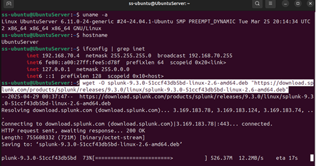
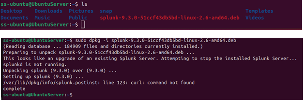
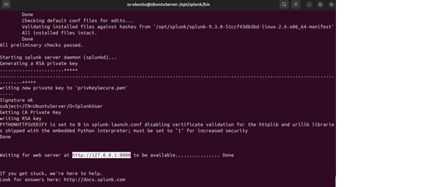
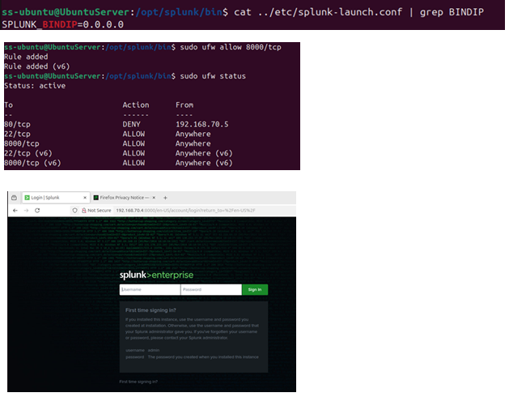
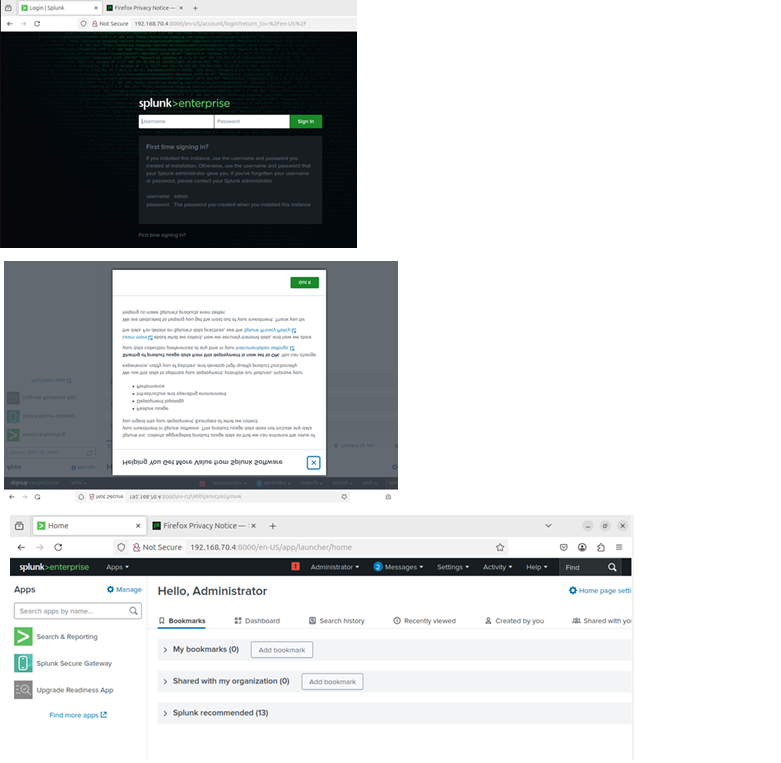

# 🛡️ Day 16 – Install and Configure Splunk

## 📌 Objective
Install and configure Splunk on an Ubuntu machine to collect and analyze security logs in a local SOC environment.

---

## 🗂️ Table of Contents
- [Objective](#objective)
- [Lab Setup](#lab-setup)
- [Steps to Install and Configure Splunk](#steps-to-install-and-configure-splunk-on-ubuntu)
  - [Step 1: Download Splunk](#step-1-download-splunk)
  - [Step 2: Enable Splunk as a Service](#step-2-enable-splunk-as-a-service)
  - [Step 3: Access Splunk Web Interface](#step-3-access-splunk-web-interface)
- [Key Learnings](#key-learnings)
- [Conclusion](#conclusion)


## 🛠️ Lab Setup

## Requirements
- System: Ubuntu Server 24-24.04.1 [ss-ubuntu - 192.168.70.4]
- Tools Required:
    - Splunk Enterprise (Free version for local setup)
    - Terminal (Command Line Access)


---

## 🧪 Steps to Install and Configure Splunk on Ubuntu

### Step 1: Download Splunk
1. Open Terminal and download Splunk using wget:
```
wget -O splunk-9.3.0-51ccf43db5bd-linux-2.6-amd64.deb "https://download.splunk.com/products/splunk/releases/9.3.0/linux/splunk-9.3.0-51ccf43db5bd-linux-2.6-amd64.deb" 
```

### 📸 Screenshot - Download Splunk
<p align="center">
  
</p> <p align="center"><em>Download Splunk</em></p>


2. Install Splunk
``` 
sudo dpkg -i splunk-9.3.0-51ccf43db5bd-linux-2.6-amd64.deb
```

### 📸 Screenshot - Install Splunk
<p align="center">
  
</p> <p align="center"><em>Install Splunk</em></p>


### Step 2: Enable Splunk as a Service
1. Move to the splunk installation directory
```
cd /opt/splunk/bin
```

2. Accept the license agreement and enable Splunk at boot:
```
sudo ./splunk enable boot-start --accept-license
```

3. Start Splunk
```
sudo ./splunk start
```

### 📸 Screenshot - Start Splunk
<p align="center">
  
</p> <p align="center"><em>Start Splunk service</em></p>


4. When prompted, set up a admin username and password

### Step 3: Access Splunk Web Interface
1. Splunk install above can ONLY be accessible locally from http://127.0.0.1:8000. and can only be access via browser of your Linux desktop. To make Splunk accessible from other machines on the network (instead of just localhost), you must update the bind IP and open the required port:

    - Update Blind IP address in splunk-launch.conf
    ```
    sudo vi /opt/splunk/etc/splunk-launch.conf
    # Add this line
    SPLUNK_BINDIP=0.0.0.0
    ```

    - Allow port 8000 through the firewall
    ```
    sudo ufw allow 8000/tcp
    ```
    
    - Then access Splunk at:
    ```
    http://<ubuntu-server-ip>:8000 or http://192.168.70.4:8000
    ``` 

### 📸 Screenshot - Access Splunk Web Interface
<p align="center">
  
</p> <p align="center"><em>Splunk Web Interface</em></p>


2. Log in with the admin credentials created above

### 📸 Screenshot - Splunk Admin Login
<p align="center">
  
</p> <p align="center"><em>Splunk Admin Login</em></p>


---

## 🧠 Key Learnings
- ✅ Learned how to download and install `.deb` packages via terminal  
- ✅ Enabled Splunk as a system service with auto-start  
- ✅ Configured IP binding and firewall rules to allow remote access  
- ✅ Accessed the Splunk Web UI and verified admin login  

---

## 🎯 Conclusion
Successfully installed and configured Splunk Enterprise on an Ubuntu system. Enabled boot-time service and modified IP bindings and firewall settings to make the Splunk web interface accessible over the local network. This lab provides a foundational setup for future log ingestion, security monitoring, and SOC investigations.

