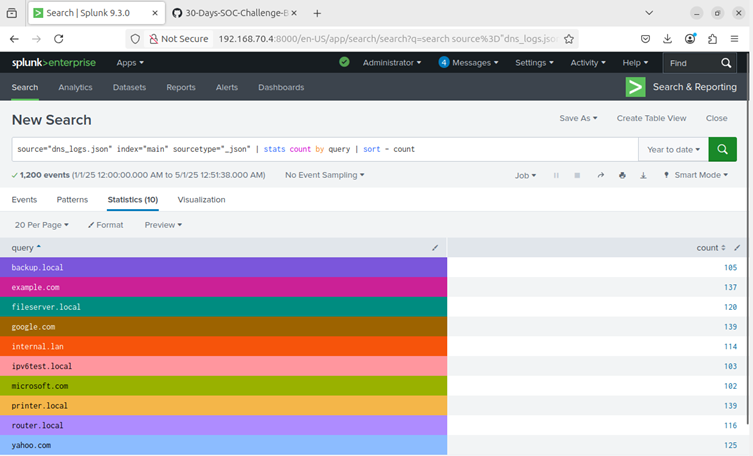
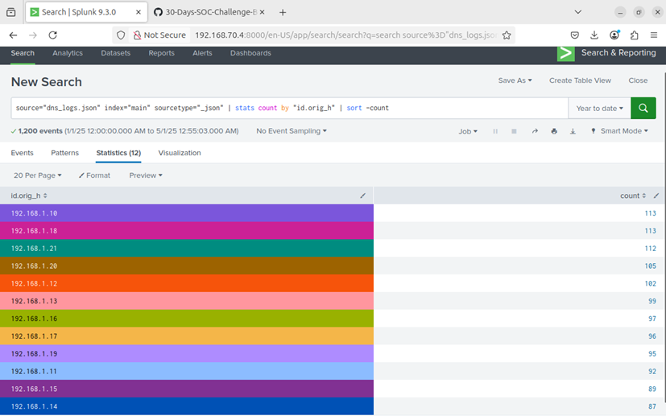
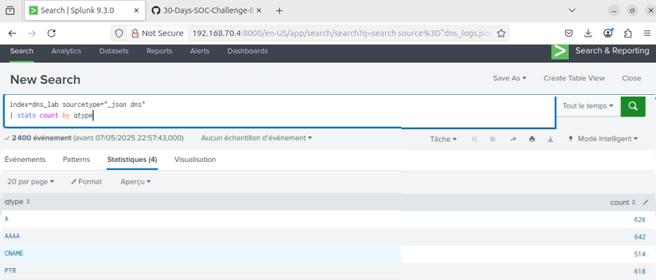

#  Day 17 – Splunk DNS Log Analysis Using Zeek Logs


## 📌 Objective
In this lab, I practiced how to:
- Ingest and analyze DNS logs in Splunk
- Extract meaningful data such as query types, source hosts, and top destinations
- Build and run basic SPL (Search Processing Language) queries to investigate DNS activity


## 🗂️ Table of Contents
- [Objective](#objective)
- [Lab Setup](#lab-setup)
- [Upload DNS Log into Splunk](#steps-to-upload-dns-log-into-splunk)
- [Lab Tasks](#lab-tasks-use-spl-queries-to-perform-following-tasks)
  - [Task 1: Most Frequently Queried Domain Names](#task-1-identify-the-most-frequently-queried-domain-names)
  - [Task 2: Most Active User IPs](#task-2-find-the-most-active-user-ips-generating-dns-traffic)
  - [Task 3: DNS Query Types Breakdown](#task-3-breakdown-of-dns-query-types-a-aaaa-cname-ptr)
- [Key Learnings](#key-learnings)
- [Conclusion](#conclusion)


---

## Lab Setup 
- ✅ Splunk: Already installed and accessible.
- ✅ Data Source: JSON-formatted Zeek DNS logs.
- 🌐 Uploaded sample Log File into Splunk for ingestion.

---

## Steps to Upload DNS Log into Splunk
1. Go to Splunk Web → Settings > Add Data.
2. Choose Upload and select the file dns.log.
3. Set Source type: json or create a custom source type dns.
4. ex: Choose main or create a new index like dns_lab.
5. Finish the upload and confirm indexing.

---

## Lab Tasks: Use SPL queries to perform following tasks:

✅Task 1: Identify the most frequently queried domain names
 - SPL Query to identify the most frequently queried domain names
  ```
  source="dns_logs.json" index="main" sourcetype="_json" | stats count by query | sort -count
  ```

## 📸 Screenshot - SPL Query - Most Frequently queried Domains
<p align="center">
  
</p>


✅Task 2: Find the most active user IPs generating DNS traffic
  - SPL Query to find out the most active user IPs generating DNS traffic:'id.orig_h' (which means Source host initiating the DNS query (from Zeek logs))
  ```
  source="dns_logs.json" index="main" sourcetype="_json" | stats count by *id.orig_h* | sort -count
  ```

## 📸 Screenshot - SPL Query - Most Active User IPs generating DNS traffic
<p align="center">
  
</p>


✅Task 3: Breakdown of DNS query types (A, AAAA, CNAME, PTR)
  - SPL Query to breakdown DNS query types: 'qtype' (e.g., A, AAAA, PTR)
  ```
  source="dns_logs.json" index="main" sourcetype="_json" | stats count by qtype
  ```

## 📸 Screenshot - SPL Breakdown of DNS Query Types
<p align="center">
  
</p>

---

## Key Learnings
- Learned how to ingest logs files into Splunk
- And analyzed data using SPL (Search Processing Language) queries from the uploaded DNA logs file to extract valuable information on DNS query types, source hosts, and common destinations.

---

## Conclusion
Splunk enables centralized log collection from systems, applications, and network devices into one platform. This lab demonstrated how to ingest Zeek DNS logs and extract key insights using SPL queries. Centralized logging improves visibility, threat detection, and incident response across the SOC environment. It also supports real-time alerting, compliance auditing, and forensic analysis, making it an essential tool for modern cybersecurity operations.
