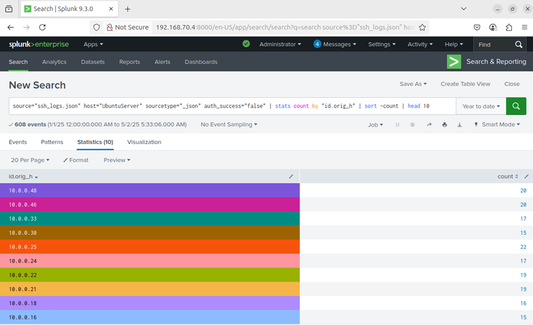
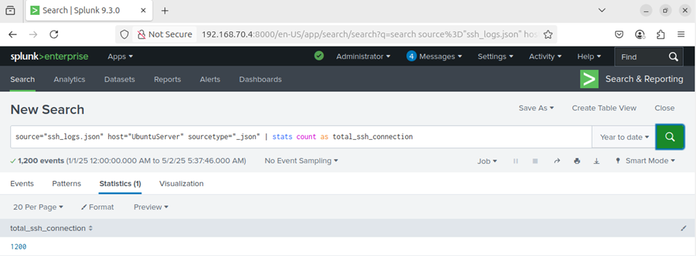
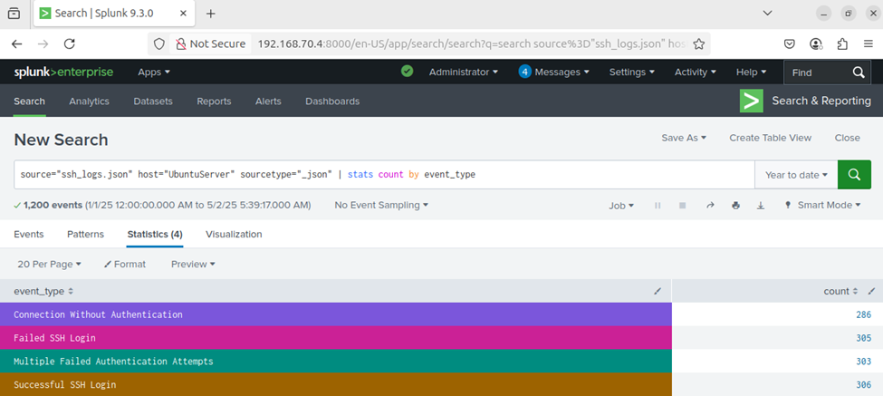

# 🛡️ Day 18 – Splunk SSH Log Analysis using Zeek logs

## Objective
In this lab, I practiced how to:
- Ingest and analyze SSH logs in Splunk
- Extract meaningful data such as failed SSH login attempts, total SSH connections and count all event types
- Build and run basic SPL (Search Processing Language) queries to investigate SSH activity

---

## Lab Setup
✅ Splunk: Already installed and accessible.
✅ Data Source: JSON-formatted Zeek-style SSH logs.
🌐 Log File: Download and upload to Splunk using the steps below.

---

## 🧪 Steps to Upload SSH Log into Splunk
1. Go to Splunk Web → Settings > Add Data.
2. Choose Upload and select synthetic_zeek_ssh.json.
3. Set Source type: json or create a new one zeek:ssh.
4. Index: Choose main or create a new index like ssh_lab.
5. Finish the upload and confirm indexing.

---

## Lab Tasks - Use SPL queries to complete the following analysis:

✅Task 1: List the top 10 endpoints with failed SSH login attempts
```
 source="ssh_logs.json" host="UbuntuServer" sourcetype="_json" auth_success=false
| stats count by "id.orig_h"
| sort -count
| head 10
```

## 📸 Screenshot
<p align="center">
  
</p>


✅Task 2: Find the number of total SSH connections
```
source="ssh_logs.json" host="UbuntuServer" sourcetype="_json" | stats count as total_ssh_connections
```

## 📸 Screenshot
<p align="center">
  
</p>


✅Task 3: Count all event types (successful, failed, 
 no-auth, multiple-failed) seen in the logs
 ```
 source="ssh_logs.json" host="UbuntuServer" sourcetype="_json" | stats count by event_type
```

## 📸 Screenshot
<p align="center">
  
</p>

---

## 🧠 Key Learnings
- Learned how to ingest logs files into Splunk
- Analyzed data using SPL (Search Processing Language) queries from SSH Brute attack sample logs fil:
    - List  top 10 endpoints with failed SSH login attempts, 
    - Find the number of total SSH connections and 
    - Count all event types (successful, failed, no-auth, multiple-failed) 

---

## 🎯 Conclusion
In this lab focused on SPL queries to ingesting and analyzing SSH logs using Splunk. And gained insights into detecting both failed and successful SSH authentication attempts. Additionally, I learned how to identify unusual SSH activity that may suggest brute force attacks or unauthorized access.
