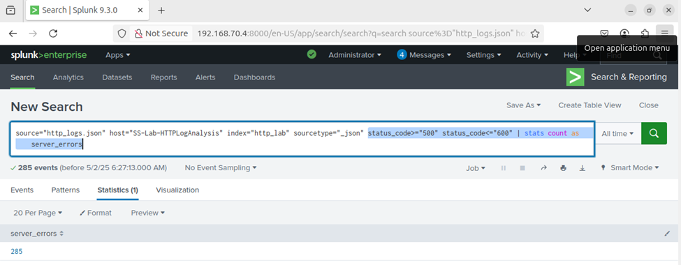
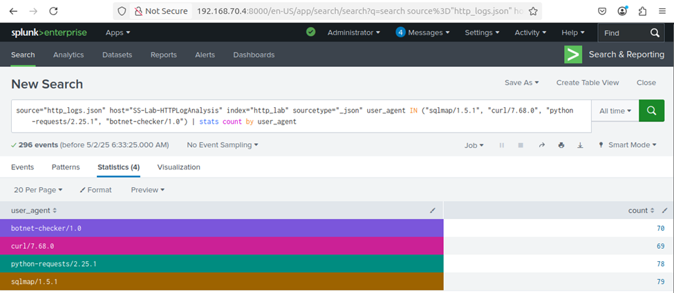
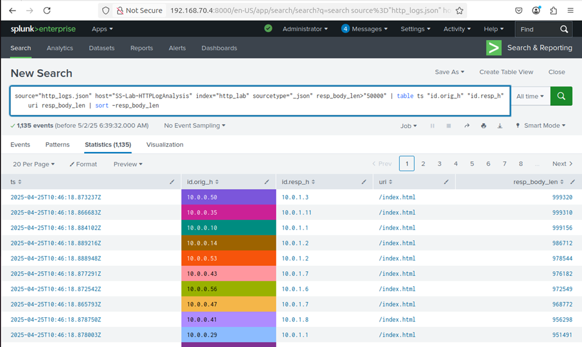

# 🛡️ Day 19 – Splunk HTTP Log Analysis Using Zeek Logs

## Objective
In this lab, you will:
- Ingest and analyze HTTP logs using Splunk.
- Detect client errors, server errors, and suspicious web activity.
- Identify large file transfers and suspicious URI access attempts.

---

## 🛠️ Lab Setup
- ✅ Splunk: Already installed and accessible.
- ✅ Data Source: JSON-formatted Zeek-style HTTP logs.
- 🌐 Log File: Download and upload to Splunk using the steps below.

---

## 🧪 Steps to Upload HTTP Log into Splunk
1. Go to Splunk Web → Settings > Add Data.
2. Choose Upload and select synthetic_zeek_http.json.
3. Set Source type: json or create a new one zeek:http.
4. Index: Choose main or create a new index like http_lab.
5. Finish the upload and confirm indexing.

---

## 🔍 Lab Tasks: Use SPL queries to complete the following analysis:

✅ Task 1: Find the top 10 endpoints generating web traffic
```
source="http_logs.json" host="SS-Lab-HTTPLogAnalysis" index="http_lab" sourcetype="_json" 
| stats count by "id.orig_h"
| sort -count
| head 10
```

## 📸 Screenshot - Top 10 Endpoints generating Web Traffic
<p align="center">
  
</p>


✅Task 2: Count the number of server errors (5xx) observed
```
source="http_logs.json" host="SS-Lab-HTTPLogAnalysis" index="http_lab" sourcetype="_json"
status_code>="500" status_code<="600"
| stats count as server_errors
```

## 📸 Screenshot
<p align="center">
  
</p>


✅Task 3: Identify User-Agents associated with possible scripted attacks
```
source="http_logs.json" host="SS-Lab-HTTPLogAnalysis" index=http_lab sourcetype="json" user_agent IN ("sqlmap/1.5.1", "curl/7.68.0", "python-requests/2.25.1", "botnet-checker/1.0")
| stats count by user_agent
```

## 📸 Screenshot
<p align="center">
  
</p>

✅Task 4: Find large file transfers (greater than 500 KB)
```
source="http_logs.json" host="SS-Lab-HTTPLogAnalysis" index=http_lab sourcetype="json" resp_body_len>500000
| table ts "id.orig_h" "id.resp_h" uri resp_body_len
| sort -resp_body_len
```

## 📸 Screenshot
<p align="center">
  
</p>

---

## 🧠 Key Learnings
- Learned how to ingest logs files into Splunk
- And analyzed data using SPL (Search Processing Language) queries from the uploaded HTTP logs file to extract valuable information on :
    - top 10 endpoints generating web traffic, 
    - number of server errors, 
    - identify User-Agents associated with possible scripted attack 
    - Find large file transfers.

---

## 🎯 Conclusion
Splunk enables centralized log collection from systems, applications, and network devices into one platform. This lab demonstrated how to find top 10 endpoints generating web traffic, count number of server errors, identify user-agents associated with possible scripted attacks and find large file transfer. It also supports real-time alerting, compliance auditing, and forensic analysis, making it an essential tool for modern cybersecurity operations.
