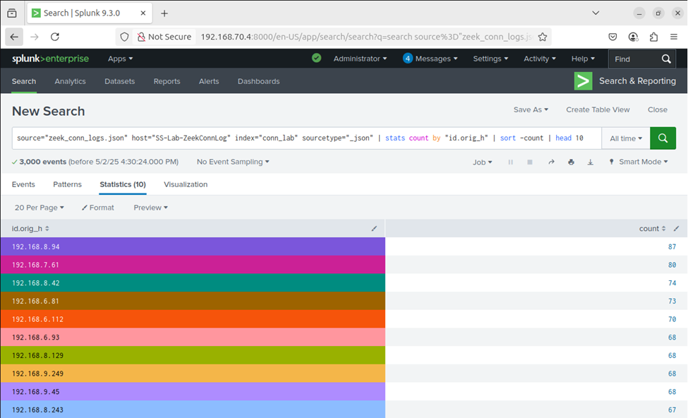
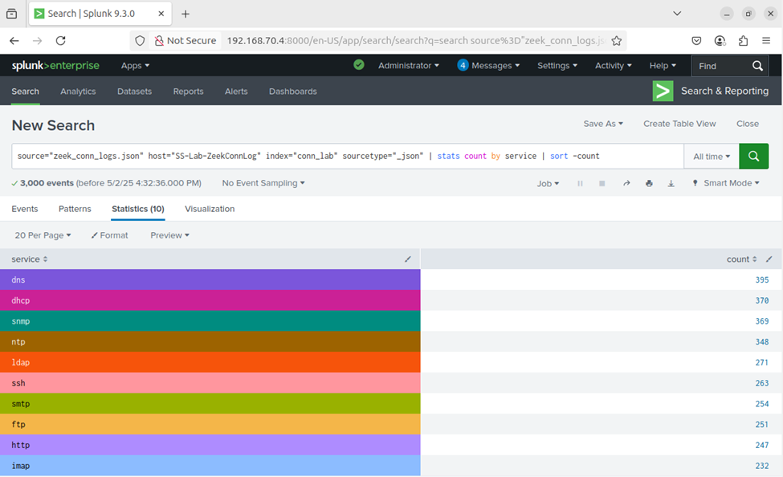
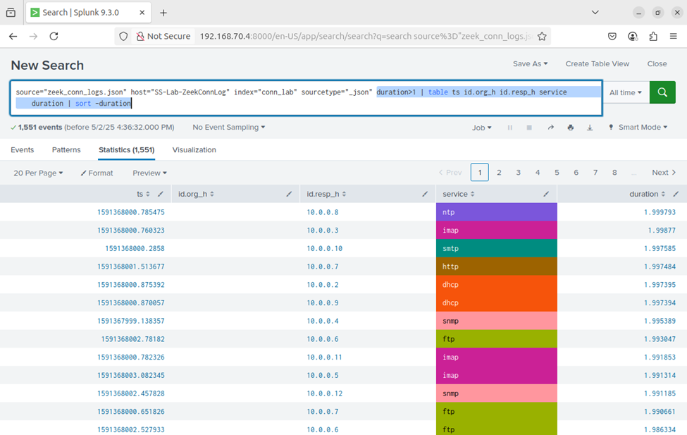
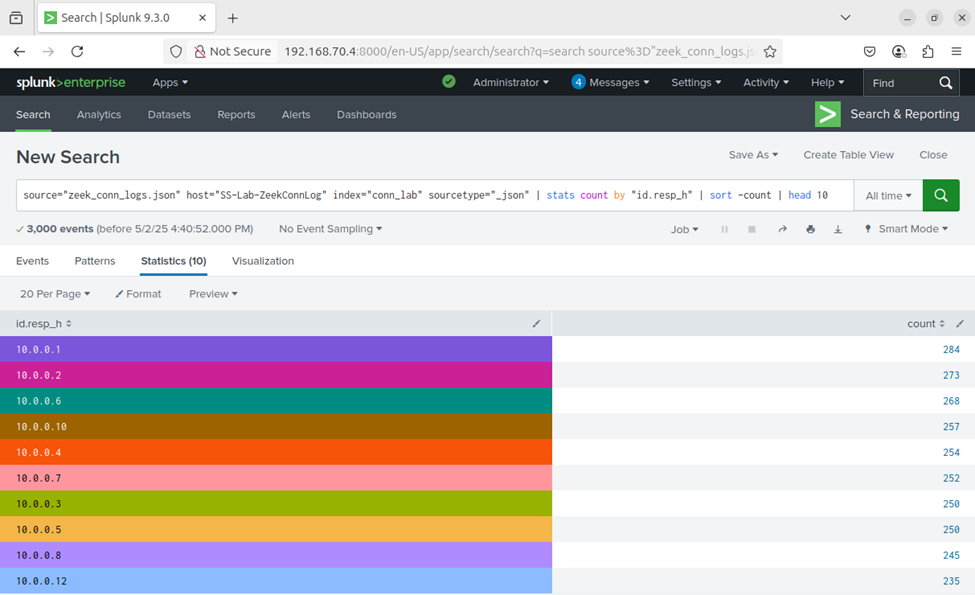

# 🛡️ Day 20 – Splunk - Zeek Connection Log Analysis

## Objective

In this lab, I practiced how to:
- Upload and search Zeek connection logs in Splunk
- Identify top client IPs, frequently accessed services, and internal servers
- Detect high-duration connections that may indicate anomalies

## 🗂️ Table of Contents
- [Objective](#objective)
- [Lab Setup](#lab-setup)
- [Steps to Upload Conn Log into Splunk](#steps-to-upload-conn-log-into-splunk)
- [Lab Tasks](#lab-tasks-use-the-following-spl-queries-to-complete-each-task)
  - [Task 1: Top 10 Client IPs](#task-1-find-the-top-10-client-ips-idorigh)
  - [Task 2: Most Common Services](#task-2-list-most-common-services)
  - [Task 3: Long Duration Connections](#task-3-find-connections-with-duration--1-second)
  - [Task 4: Most Accessed Internal Servers](#task-4-identify-the-most-accessed-internal-servers)
- [Key Learnings](#key-learnings)
- [Conclusion](#conclusion)


---

## Lab Setup
✅ Splunk: Already installed and accessible.
✅ Data Source: JSON-formatted Zeek-style connection logs.
🌐 Log File: Download and upload to Splunk using the steps below.

---

## Steps to Upload Conn Log into Splunk
- Go to Splunk Web → Settings > Add Data.
- Choose Upload and select zeek_conn_logs.json.
- Set Source type: json or create a new one like zeek:conn.
- Index: Use main or create a new one called conn_lab.
- Complete the upload and check that logs are searchable.

---

 ## Lab Tasks: Use the following SPL queries to complete each task:

### Task 1: Find the Top 10 Client IPs (id.orig_h)
```
source="zeek_conn_logs.json" host="SS-Lab-ZeekConnLog" index=conn_lab sourcetype="json"
| stats count by id.orig_h
| sort -count
| head 10
```

### 📸 Screenshot - Top 10 Client IPs
<p align="center"> 
  
</p>

### Task 2: List Most Common Services
``` 
source="zeek_conn_logs.json" host="SS-Lab-ZeekConnLog" index=conn_lab sourcetype="json"
| stats count by service
| sort -count
```

### 📸 Screenshot - Most Common Services
<p align="center">
  
</p>

### Task 3: Connections with Duration > 1 Second
```
source="zeek_conn_logs.json" host="SS-Lab-ZeekConnLog" index=conn_lab sourcetype="json" duration>1
| table ts id.orig_h id.resp_h service duration
| sort -duration
```

### 📸 Screenshot - Connections with Duration > 1 second
<p align="center">
  
</p>

###Task 4: Identify the Most Accessed Internal Servers
```
source="zeek_conn_logs.json" host="SS-Lab-ZeekConnLog" index=conn_lab sourcetype="json"
| stats count by "id.resp_h"
| sort -count
| head 10
```

### 📸 Screenshot - Most Accessed Internal Servers
<p align="center">
  
</p>

---

## Key Learnings
- ✅ Uploaded and indexed Zeek connection logs in JSON format  
- ✅ Used SPL queries to find top clients, servers, and most common services  
- ✅ Detected long-duration sessions that may indicate beaconing or tunneling  
- ✅ Practiced statistical aggregation and sorting to extract network insights  


---

## Conclusion
This lab demonstrated how to ingest and analyze Zeek connection logs using Splunk. By querying connection metadata, I gained insights into network flow patterns such as which hosts are most active, what services are used, and how long sessions last. These are core skills for threat hunting, anomaly detection, and building a strong network visibility baseline within a SOC.
