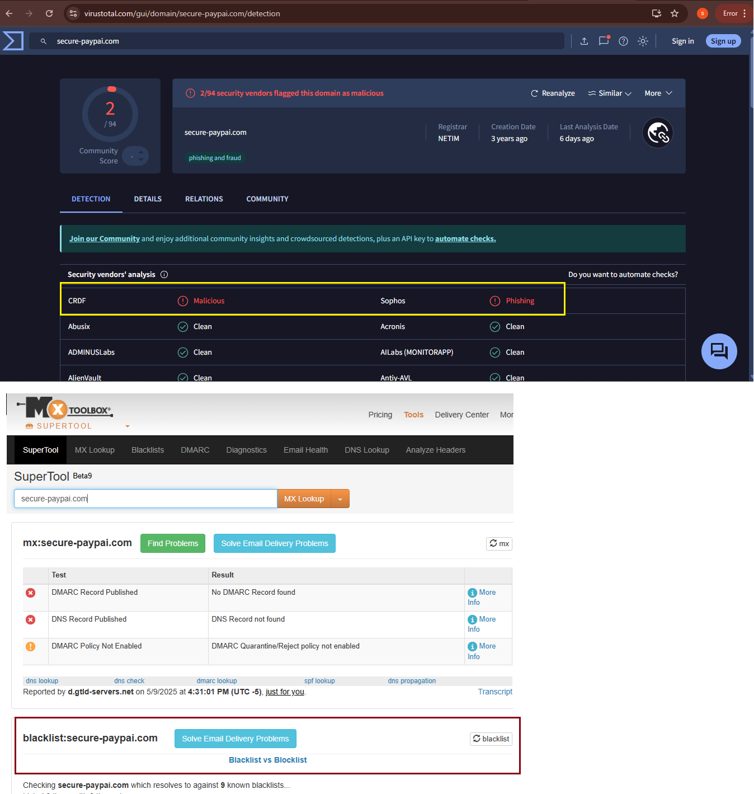

# 🛡️ Day 21 – Introduction to Phishing Analysis

## Objective

Learn how to analyze a phishing email by examining headers, body, URLs, and attachments. Understand different phishing types and techniques, and explore open-source tools to investigate and extract Indicators of Compromise (IOCs).

---

## 🗂️ Table of Contents

- [What is Phishing Analysis?](#what-is-phishing-analysis)
- [Types of Phishing Attacks](#types-of-phishing-attacks)
- [Phishing Techniques with Examples](#phishing-techniques-with-examples)
- [Common Tools Used in Phishing Analysis](#common-tools-used-in-phishing-analysis)
- [Phishing Analysis Process](#phishing-analysis-process)
- [Suspicious Email Attachment Indicators](#suspicious-email-attachment-indicators)
- [Task: Investigating a Lookalike Domain Email](#task-investigating-a-lookalike-domain-email)
- [Submission](#submission)

---

## What is Phishing Analysis?

**Phishing Analysis** is the process of investigating suspicious emails to determine if they aim to deceive users into revealing sensitive information or executing malicious code. This includes analyzing metadata, links, attachments, and content for red flags.

---

## Types of Phishing Attacks

| **Type**                         | **Description**                          |
|----------------------------------|------------------------------------------------------|
| Email Phishing                   | Mass emails pretending to be from trusted brands  |         
| Spear Phishing                   | Personalized emails targeting specific individuals      |
| Whaling                          | Spear phishing targeting executives (e.g., CEO fraud)     |
| Smishing                         | SMS-based phishing with malicious links                   |
| Vishing                          | Voice-based phishing over phone calls                     |
| Clone Phishing                   | A legitimate email copied and modified to include malicious content|
| Business Email Compromise (BEC)  | Executive impersonation to trick employees into financial or data disclosure|

---

## Phishing Techniques with Examples

| **Technique**                | **Example**                      |
|-----------------------------|----------------------------------------------|
| Display Name Spoofing       | `From: Microsoft Support <helpdesk@micros0ft.com>`      |
| Lookalike Domains           | `accounts@secure-paypai.com` instead of `paypal.com`    |
| URL Redirection             | `http://bit.ly/securelogin` → redirects to phishing site       |
| HTML Form in Email          | Fake login form embedded directly in email            |
| Macro-Based Document        | Embedded macro triggers PowerShell                     |
| QR Code Phishing (Quishing) | QR code leads to credential harvesting site             |
| Attachment-Only Phishing    | No body text, only a malicious file (`.zip`, `.docx`, etc.)   |

---

## Common Tools Used in Phishing Analysis

| Tool                       | Purpose                                                |
|----------------------------|--------------------------------------------------------|
| Email Header Analyzer      | Decode metadata, trace sender IP and domain           |
| VirusTotal                 | Scan links and files for malicious indicators          |
| Hybrid Analysis / Any.Run | Sandbox dynamic analysis of attachments or URLs       |
| OLETools                   | Analyze embedded macros in Office files                |
| CyberChef                  | Decode encoded content (base64, hex, etc.)             |
| Base64 Decoder             | Reveal obfuscated payloads                             |
| Whois / IP Lookup          | Investigate sender’s domain and IP reputation          |

---

## Phishing Analysis Process

| **Step** | **Action**                                                                 |
|---------|------------------------------------------------------------------------------|
| 1. Collect Email Sample         | Save as `.eml` or `.msg` file for offline analysis        |
| 2. Analyze Email Headers        | Review SPF/DKIM/DMARC, Return-Path, sender IP             |
| 3. Examine Body Content         | Check tone, urgency, and unusual phrasing or logos        |
| 4. Hover Over URLs              | Inspect real destination without clicking                 |
| 5. Scan URLs and Attachments    | Use VirusTotal or sandbox for behavior analysis           |
| 6. Decode Obfuscated Content    | Use CyberChef to uncover base64/hex-encoded threats       |
| 7. Extract IOCs                 | Gather domains, hashes, URLs, IPs                         |
| 8. Respond and Report           | Block malicious assets, notify users, and document incident |

---

## Suspicious Email Attachment Indicators

| **Indicator**                     | **Example**                                 |
|----------------------------------|---------------------------------------------|
| Executables disguised as docs    | `Invoice.pdf.exe`, `Resume.doc.scr`         |
| Encrypted ZIPs                   | Password-protected archives with payloads   |
| Macro-enabled Office files       | `.docm`, `.xlsm` with malicious scripts     |
| Encoded payloads in HTML/scripts | Base64 or hex hidden in source              |
| Social engineering themes        | Fake invoices, resumes, alerts              |

---

## Task: Investigating a Lookalike Domain Email

### Scenario:
Your SOC received an email claiming to be from PayPal, sent from: noreply@secure-paypai.com

### Question 1:  
What is the reputation of the domain?

## Use tools like:
- [VirusTotal](https://www.virustotal.com/)
- [Talos Intelligence](https://talosintelligence.com/)
- [Whois Lookup](https://who.is/)
- [AbuseIPDB](https://abuseipdb.com/)
- [MxToolBox](https://mxtoolbox.com/)

---

## Phishing Analysis Summary
I investigated the suspicious sender domain noreply@secure-paypai.com, which impersonates PayPal using a lookalike domain (secure-paypai.com). I used multiple tools — VirusTotal, Whois Lookup, and MxToolBox — to assess its reputation. All sources flagged the domain as associated with phishing activity. The investigation confirmed display name spoofing and URL deception, commonly used in credential-harvesting campaigns.

## 📸 Screenshot Evidence

  

---

