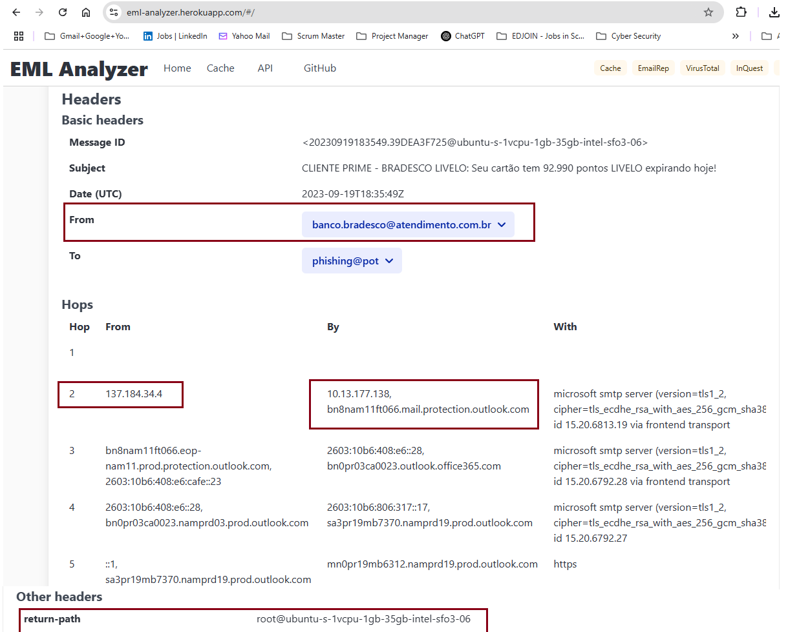
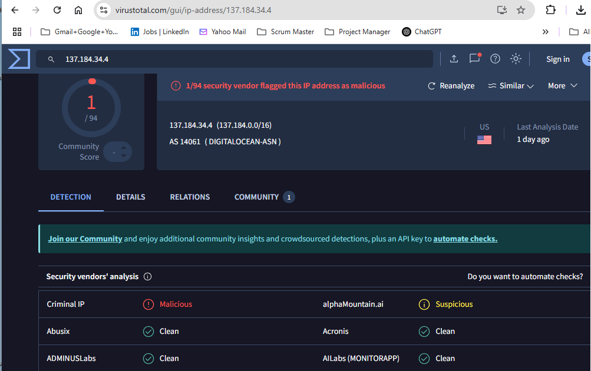
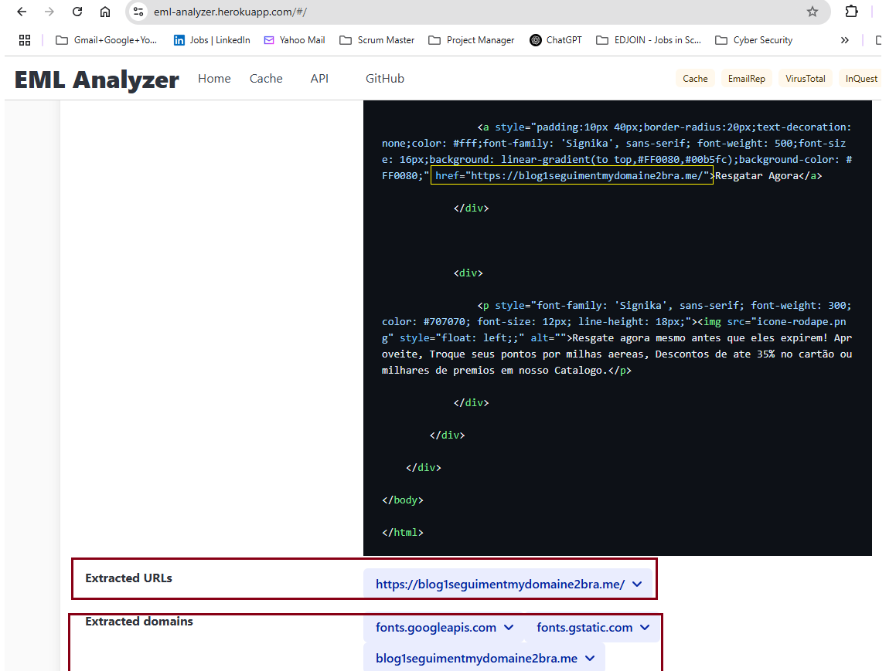

# 🛡️ Day 22 – Phishing Analysis: Investigating a Phishing Email

## 📌 Objective
Analyze a real-world phishing email sample using manual techniques. Learn to inspect email headers, validate the sender's identity, check domain and IP reputation, extract IOCs (Indicators of Compromise), and assess email content for deception.

---

## 🛠️ Lab Setup
📨 **Email Format**: Download and use `.eml` file for analysis  
- 🧰 **Tools Used**:
  - [MXToolbox Email Header Analyzer](https://mxtoolbox.com/EmailHeaders.aspx)
  - [EML Analyzer](https://eml.analyzer.tool/) or local viewer (e.g., Thunderbird)
  - [VirusTotal](https://virustotal.com/), [AbuseIPDB](https://abuseipdb.com/), [Cisco Talos](https://talosintelligence.com/)
  - [DomainTools Whois](https://whois.domaintools.com/)
  - [urlscan.io](https://urlscan.io/) for domain & URL analysis

---

## 🧪 Task: Analyze the Suspicious Email

### 📥 Scenario:

You received an email from **BANCO DO BRADESCO LIVELO** claiming that your card has **92,990 points expiring today**, sent from the address: banco.bradesco@atendimento.com.br

### 🔍 Questions to Answer
1. ✅ What is the **full email address** of the sender?  
2. ✅ What **domain** is used to send this email? *(Check `From` or `Return-Path`)*  
3. ✅ What is the **sender’s IP address**? *(Extracted from header)*  
4. ✅ Is the **sender IP blacklisted**? *(Check with AbuseIPDB or VirusTotal — Yes/No)*  
5. ✅ What is the **SPF authentication result**? *(Pass / Fail / Neutral)*  
6. ✅ What is **one suspicious URL** found in the email body?

---

## 📸 Required Submissions

- Screenshot of the **email header** showing:
  - From
  - Return-Path
  - Sender IP address

### 📸 Screenshot - Email header with From, Return-path and Senders IP

  

- Screenshot of **IP reputation lookup**
  - (AbuseIPDB, VirusTotal, or Talos)

  ### 📸 Screenshot - Virus Total - IP reputation lookup

 
  

- Screenshot of **email content or suspicious URL**
  - Show spoofed branding, urgency, or malicious intent

### 📸 Screenshot - Email content with suspicious URL

  

 

---

### Recap 
This investigation confirmed that the sender’s domain was suspicious and the IP was flagged by reputation services. A spoofed brand and urgent messaging were present in the body content.

## ✅ Learning Outcome

By completing this lab, you will be able to:

- 🕵️ Trace and analyze email origin using headers  
- 🌐 Validate sender domain and IP reputation  
- 🎭 Recognize spoofing and social engineering techniques  
- 🧩 Extract malicious URLs or attachments (IOCs)  
- 🔐 Strengthen detection capability for phishing emails in real-world scenarios

