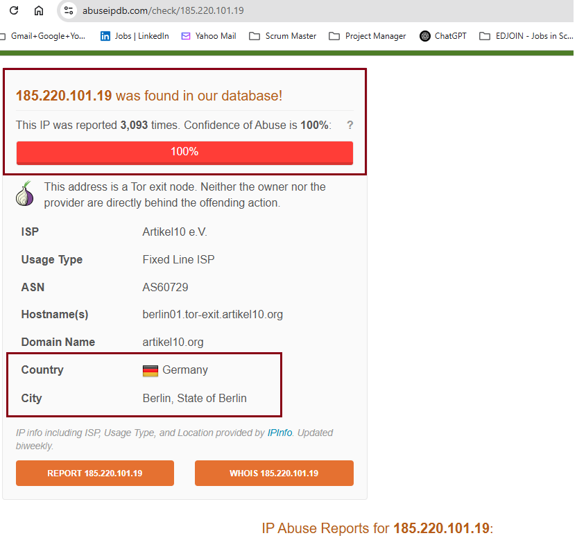
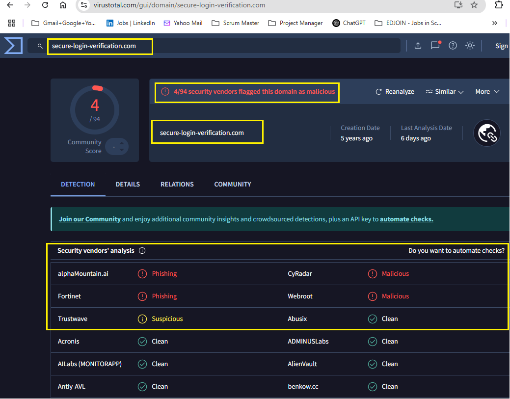
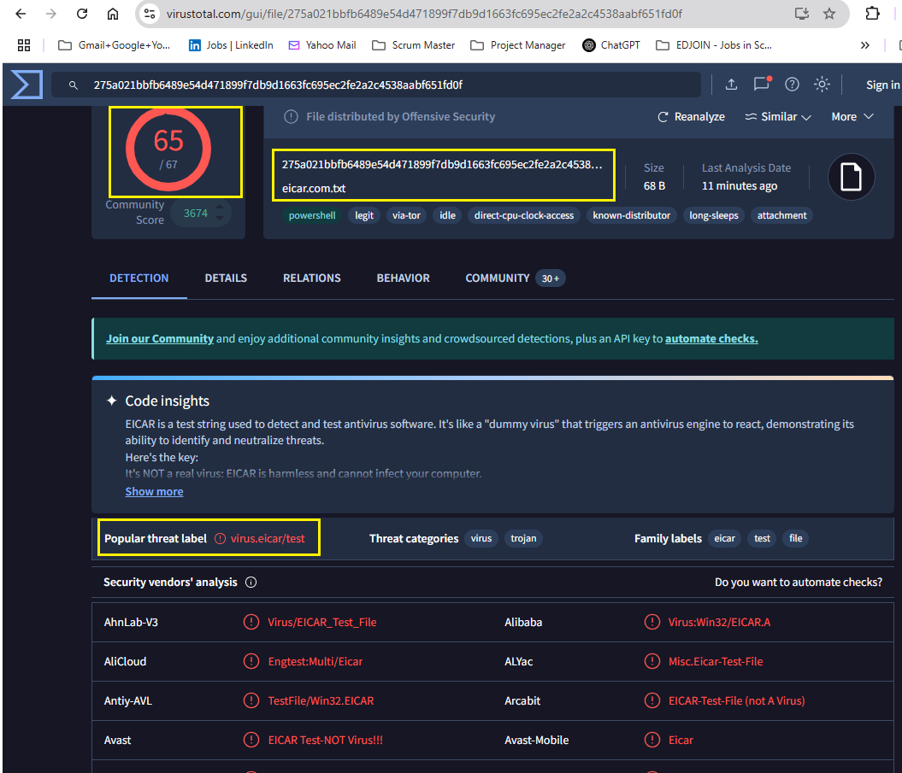
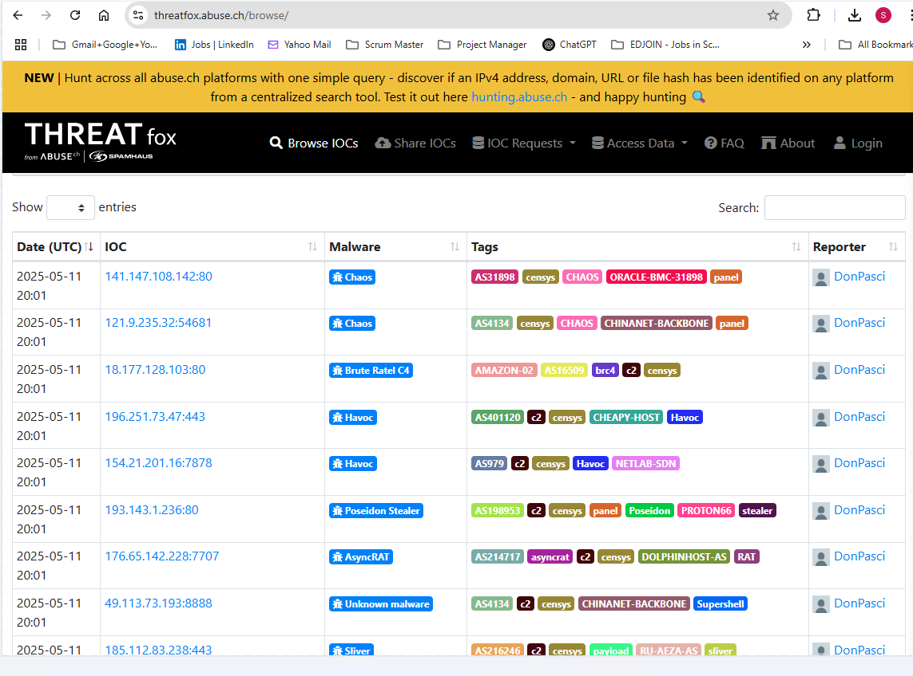

# 🛡️ Day 23 – Threat Intelligence Basics
## Objective

In this lab, I practiced extracting Indicators of Compromise (IOCs) from a suspicious email and enriched them using open-source threat intelligence platforms. I aimed to assess the context and maliciousness of IPs, domains, and hashes to support incident response decisions.

## Table of Contents
- [Objective](#objective)
- [What is Threat Intelligence?](#what-is-threat-intelligence)
- [Types of Threat Intelligence](#types-of-threat-intelligence)
- [Lab Setup](#lab-setup)
- [Tasks](#tasks)
- [Required Submission](#required-submission)
- [Learning Outcome](#learning-outcome)

## What is Threat Intelligence?
Threat Intelligence (TI) is information about threats, threat actors, and their tactics. It helps SOC analysts investigate alerts faster, make informed decisions, and respond to incidents more effectively.

## Types of Threat Intelligence

| Type       | Description                                                |
|------------|------------------------------------------------------------|
| Tactical   | Low-level IOCs like IPs, hashes, domains                   |
| Operational| Info on campaigns, malware families, and TTPs              |
| Strategic  | Trends, motivations, threat actors, and geopolitical risks |

---

## Lab Setup
- 📩 Download Email Sample: sample-1.eml
- 💻 Tools You Will Use:
    - VirusTotal
    - AbuseIPDB
    - URLScan.io
    - AlienVault OTX
    - ThreatFox
    - MXToolbox Header Analyzer

---

## Tasks
- What is the type of the malicious file?
- What country is this IP registered in?
- What malware name (if any) is associated with this file on VirusTotal?

---

## Required Submission
- 🔹 IP Lookup - The IP address 185.220.101.19 belongs to a Tor network and has a self-signed certificate for anonymity

 ### Screenshot from AbuseIPDB showing details of 185.220.101.19

  

- 🔹 Domain Lookup - The domain name secure-login-verification.com is associated with phishing attacks. 

 ### Screenshot - VirusTotal showing details of secure-login-verification

  

- 🔹 Hash Analysis - The hash 44d88612fea8a8f36de82e1278abb02f is associated with the Eicar testing file and is not malicious. Screenshot from VirusTotal showing file type, detection ratio, and malware name for the hash 44d88612fea8a8f36de82e1278abb02f. It's merely used to trigger antivirus software detection mechanisms.

 ### Screenshot - VirusTotal showing details of Hash

  

-🔹 Threat Intelligence Feed (Optional Bonus) - The IOC found in AlienVault OTX or ThreatFox with campaign name or tags

 ### Screenshot - ThreatFox with compaign tags

  

### 🧾 Recap
All three IOCs analyzed were relevant for understanding attacker infrastructure and techniques. The IP was tied to a Tor node, the domain flagged as phishing-related, and the hash matched a benign EICAR test file. This reinforced the importance of context when triaging alerts in the SOC.

## Learning Outcome
In this lab, I learned:
- How to extract IOCs from suspicious phishing emails
- And use Threat Intelligence tools to investigate their context and maliciousness, such as assess IPs, domains, and links
- Gain confidence in making escalation decisions based on threat intelligence
- Develop investigation habits like documentation and screenshot evidence

---

