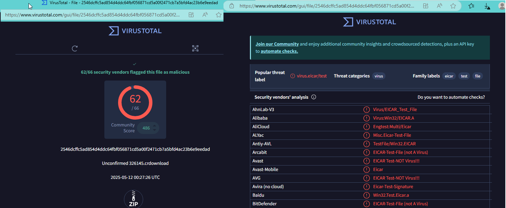
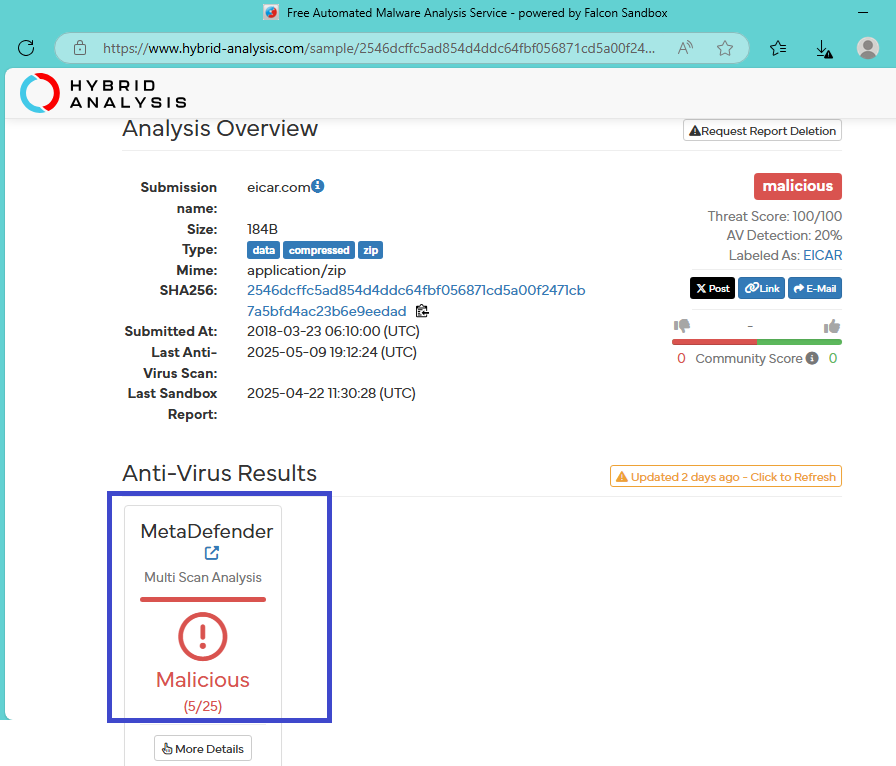
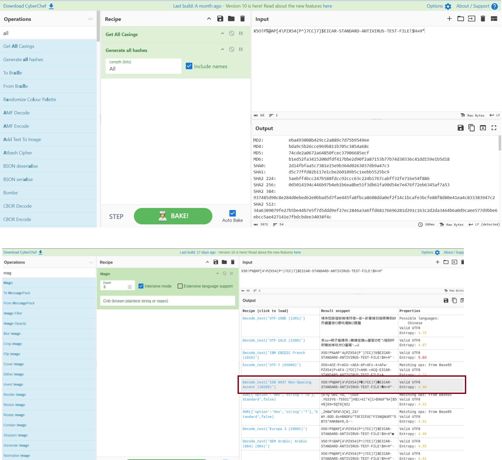
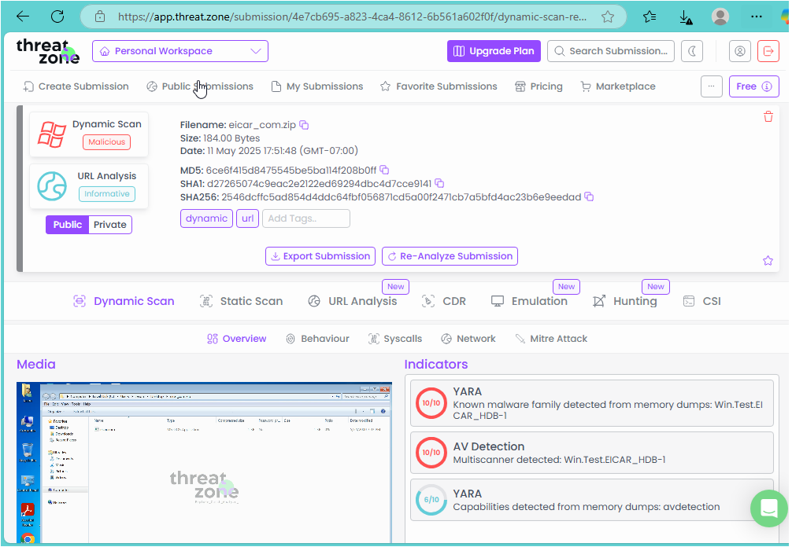

# 🛡️ Day 24 – Introduction to Malware Analysis

## Objective
This lab introduces the basics of malware analysis. I learned how to identify malicious files, analyze them statically using free tools, and extract indicators like file names, hashes, strings, and behavior — all without needing to run the malware.

## 🗂️ Table of Contents
- [Lab Objective](#lab-objective)
- [What is Malware Analysis?](#what-is-malware-analysis)
- [Types of Malware Analysis](#types-of-malware-analysis)
- [Key Objectives](#key-objectives)
- [Static Malware Analysis – Activity, Purpose, and Tools](#static-malware-analysis--activity-purpose-and-tools)
- [Lab Setup](#lab-setup)
- [Tools You’ll Use](#tools-youll-use)
- [Lab Tasks](#lab-tasks--perform-static-malware-analysis)
- [Submission Checklist](#submission-checklist)
- [Learning Outcome](#learning-outcome)

---

## 🧠 What is Malware Analysis?
Malware Analysis is the process of examining malicious software to understand its origin, behavior, impact, and indicators. It helps SOC analysts detect infections, contain threats, and prevent future compromises.

## 🔍 Types of Malware Analysis:

| **Type**       | **Description**                                         |
|------------|-------------------------------------------------------------|
| Static Analysis     | Examining a file without executing it              |
| Memory Analysis     | Investigating malware artifacts in memory          |
| Reverse Engineering | Deconstructing the code (advanced)                 |

--- 

## ✅ Key Objectives:

- Identify the type of malware (e.g., trojan, ransomware, info-stealer)
- Determine how it spreads (email, USB, download, vulnerability)
- Understand its behavior (file modifications, network connections, persistence)
- Extract IOCs (Indicators of Compromise) (hashes, domains, IPs, registry keys)
- Help in detection and prevention (create YARA rules, update AV signatures, SIEM rules)
- Support incident response (understand timeline, impact, and cleanup strategy)

## 🧠 Static Malware Analysis – Activity, Purpose, and Tools

| **Activity**           | **Purpose**             | **Tools You Can Use**      |
|------------------------|-------------------------|------------------------------------------|
| 🔍 Check File Hash | Identify file uniquely and compare with threat intel DBs  | VirusTotal, HashCalc, HashMyFiles, PowerShell Get-FileHash |
| 🛑 Check Antivirus Detections | See if AV engines detect the file as malicious  | VirusTotal, MetaDefender, Hybrid Analysis |
| 📎 Inspect File Metadata | Gather details like size, type, compile time | ExifTool, PEStudio, Detect It Easy (DIE)|
| 🎛️ Check File Type & Entropy | Detect packing, encryption, or anomalies | Detect It Easy (DIE), PEStudio, binwalk  |
| 🧵 Extract Strings  | Reveal readable content like domains, URLs, commands | `strings`, FLOSS, BinText |
| 🔐 Detect Obfuscation/Packing | Detect packing or obfuscation  | PEiD, Detect It Easy (DIE), PEStudio  |
| 🌐 Scan Embedded URLs/Domains | Identify malicious infrastructure  | VirusTotal, CyberChef, URLScan.io |
| 🔁 Analyze Imports/Functions | Examine API calls and system behaviors  | PEStudio, CFF Explorer, IDA Free, Ghidra    |
| 🧬 Compare to Known Malware  | Check similarity to known malware samples | Intezer Analyze, Hybrid Analysis, VirusTotal Behavior  |
| 📦 Hex & Binary Inspection | Find hidden artifacts in binary form | HxD, Hexed.it, 010 Editor   |

## 🧪 Lab Tasks – Perform Static Malware Analysis

## 🛠️ Lab Setup: You will perform basic static malware analysis using a publicly known test malware file.

⚠️ I used a safe EICAR test file – not harmful, but detected by AV tools.

## 🔧 Tools You’ll Use:
- EICAR Test Malware Sample FIle
- VirusTotal
- Hybrid Analysis
- Any.Run (Optional)
- CyberChef
- Intezer Analyze (Optional)
- Strings or Hex Viewer (e.g., https://hexed.it)

## 📝 Submission Checklist
- ✅ Submit the following screenshots:
    - VirusTotal scan result with detection tab

### 📸 Screenshot - VirusTotal Scan Result

  

    - Sandbox result (Hybrid Analysis or Any.Run)

  ### 📸 Screenshot - Hybrid Analysys

  

    - CyberChef base64 decoding step

### 📸 Screenshot - CyberChef base64 decoding

  

    - Any other interesting output or IOC

### 📸 Screenshot - Other Interesting IOC

  

## ✅ Learning Outcome
By completing this lab, I:

- Understood the fundamentals of static malware analysis
- Used tools like VirusTotal, Hybrid Analysis, CyberChef, and hex viewers
- Practiced extracting IOCs (hashes, URLs, behavior)
- Documented findings using screenshots like a SOC analyst

---