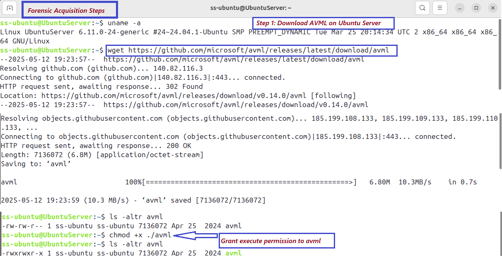
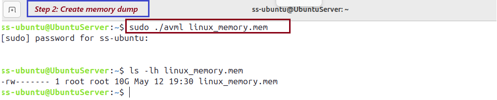

# # 🛡️ Day 25 – Digital Forensics: Memory Acquisition with AVML

---

## Objective

This lab introduces the basics of digital forensics by guiding through the acquisition of a Linux memory dump using Microsoft's AVML tool. The goal is to learn how to collect live memory from an Ubuntu system, validate the captured image, and securely transfer it to a forensic analysis workstation.

## 🗂️ Table of Contents

- [Objective](#objective)
- [What is Digital Forensics?](#what-is-digital-forensics)
- [Goals of Digital Forensics](#goals-of-digital-forensics)
- [Types of Digital Forensics](#types-of-digital-forensics)
- [Digital Forensics Process](#digital-forensics-process)
- [Lab Setup](#lab-setup)
- [Lab Tasks – Acquire and Transfer Linux Memory Dump](#lab-tasks--acquire-and-transfer-linux-memory-dump)
  - [Step 1: Download AVML](#-step-1-download-avml)
  - [Step 2: Make AVML Executable](#-step-2-make-avml-executable)
  - [Step 3: Capture the Memory Dump](#-step-3-capture-the-memory-dump)
  - [Step 4: Validate the Dump Using Strings](#-step-4-validate-the-dump-using-strings)
  - [Step 5: Transfer the Dump to the Analysis Machine](#-step-5-transfer-the-dump-to-the-analysis-machine)
- [Submission Checklist](#submission-checklist)
- [Observation](#observation)
- [Learning Outcome](#learning-outcome)


---

## What is Digital Forensics?

**Digital Forensics** is the science of identifying, preserving, analyzing, and presenting digital evidence in a legally admissible way. It plays a critical role in cybercrime investigations, insider threat analysis, data breaches, and incident response.

---

## Goals of Digital Forensics

- Identify and preserve digital evidence  
- Reconstruct timelines of malicious or suspicious activity  
- Determine the root cause of incidents or intrusions  
- Support legal or administrative proceedings  
- Maintain evidence integrity and chain of custody  

---

## Types of Digital Forensics

| **Type**               | **Description**               | **Common Tools**          |
|------------------------|---------------------------------------|----------------|
| Linux Forensics | Investigating logs, memory, and files on Linux systems | log2timeline, auditd, grep, KAPE, AVML |
| Windows Forensics  | Registry, Event Logs, and file analysis | FTK Imager, Registry Explorer, KAPE, PECmd  |
| Mobile Forensics | Recovering deleted data, call logs, chat artifacts  | Cellebrite, Magnet AXIOM, MobSF   |
| Network Forensics | Analyzing captured packets and intrusion traces  | Wireshark, tcpdump, Zeek, Suricata     |
| Memory Forensics  | Live RAM acquisition and volatile data analysis  | AVML, Volatility, Rekall, LiME   |
| Cloud Forensics  | Logs, API usage, and activity in cloud environments  | AWS CloudTrail, Azure Sentinel, FIR    |
| IoT Forensics   | Firmware and embedded device investigation | Autopsy, Binwalk, Firmware-Mod-Kit   |

---

## Digital Forensics Process

| **Step**       | **Description**             |
|----------------|--------------------------------------------------------------|
| Identification | Identify systems or data relevant to the incident     |
| Preservation   | Isolate the system to prevent tampering and maintain data integrity  |
| Collection     | Acquire volatile (RAM) and non-volatile (disk) evidence     |
| Analysis       | Examine collected data for malicious activity and IOCs    |
| Reporting      | Document findings, preserve logs/screenshots, and outline next steps  |

---

## Lab Setup

### Requirements:
- **System 1 (Target)**: Ubuntu 22.04 [ss-ubuntu] – where memory will be captured  
- **System 2 (Analysis)**: Kali Server [ss-kali] – where memory will be transferred  
- **User Access**: `sudo` privileges on both systems  

### Tools:
- [AVML (by Microsoft)](https://github.com/microsoft/avml) – memory acquisition  
- `strings`, `grep` – for quick validation  
- `scp` or `rsync` – for secure transfer  

---

## Lab Tasks – Acquire and Transfer Linux Memory Dump

### Step 1: Download AVML
```bash
wget https://github.com/microsoft/avml/releases/latest/download/avml
```

### Step 2: Make AVML Executable
Grant execute permissions:
```
chmod +x ./avml
Verify execution by running:
./avml --help
```
## 📸 Screenshot - AVML download & grant executable permission to AVML 
<p align="center">
  
</p>

### Step 3: Create a Memory Dump
Run the following command to acquire a memory dump and save it as linux_memory.mem:
```
sudo ./avml linux_memory.mem
Confirm the memory dump file has been created:
ls -lh linux_memory.mem
```

## 📸 Screenshot - Create a Memory dump
<p align="center">
  
</p>


### Step 4: Validate the Memory Dump
Use strings and grep to check if known data appears in the dump:
```
strings linux_memory.mem | grep "mozilla"
```
If strings related to applications, files, or processes appear, the dump is valid.

### Step 5: Transfer the Memory Dump to the Analysis Machine
On the forensic workstation: create a directory to store the memory dump:
```
mkdir ~/forensics/memory_dumps
```
Transfer the memory dump from the Target Machine to the Analysis Machine using scp:
```
scp user@<192.168.70.4>:/home/user/linux_memory.mem ~/forensics/memory_dumps/
```
Verify the file is successfully transferred:
```
ls -lh ~/forensics/memory_dumps/
```

## 📸 Screenshot - Transfer Memory dump to Analysis (Kali)) server
<p align="center">
  
</p>

---

## Submission Checklist
- ✅ Screenshot of linux_memory.mem file created on Target Machine
- ✅ Screenshot of the memory dump file inside ~/forensics/memory_dumps/ on the Analysis Machine
- ✅ Optional: Screenshot of strings | grep output showing memory content

## Observation
Memory acquisition is a critical part of digital forensics and incident response. Capturing volatile data such as running processes, open files, command-line history, and encryption keys can provide valuable insights during investigations — especially when the system might be compromised or about to be shut down. Live memory can expose evidence that does not persist on disk, helping forensic analysts uncover real-time behavior and advanced malware techniques.

## Learning Outcome
By completing this lab, I learned how to:
- Safely acquire live memory from a Linux system using AVML
- Validate memory dump contents using strings and grep
- Securely transfer forensic data to another host for further analysis
- Understand the role of memory forensics in post-incident investigations