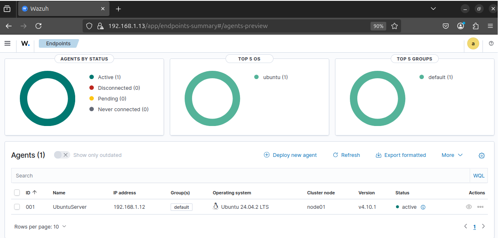
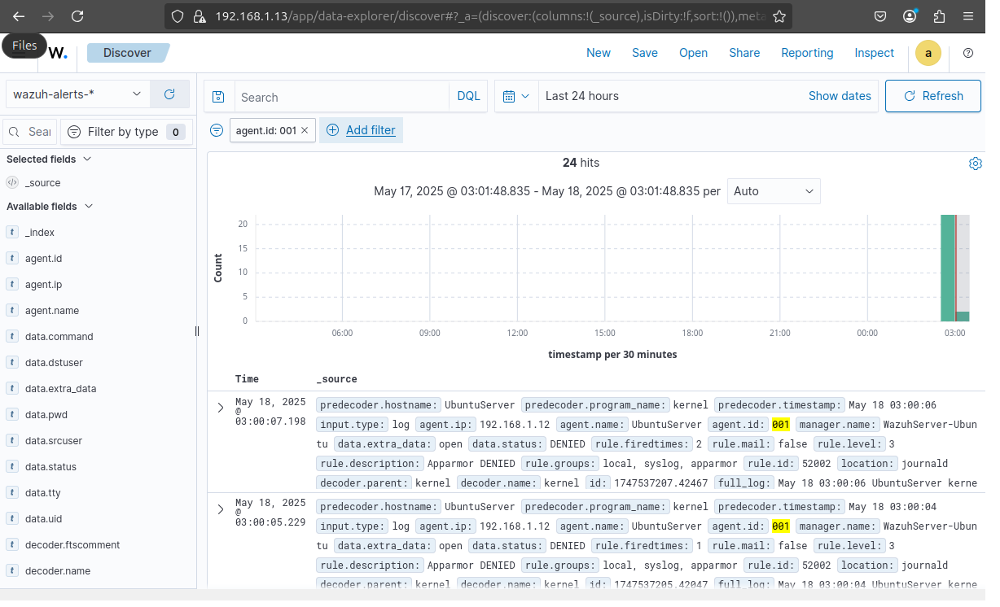

# 🛡️ Day 26 – Setting Up Wazuh: Open Source EDR and SIEM

---

## Objective

The goal of this lab is to set up a Wazuh Server using the Quick Start installation method and onboard an Ubuntu system as a Wazuh Agent. This task simulates a real-world SOC scenario where analysts deploy EDR tools to monitor endpoints, detect anomalies, and centralize security logs.

## 🗂️ Table of Contents

- [Objective](#objective)
- [Introduction to EDR (Endpoint Detection and Response)](#introduction-to-edr-endpoint-detection-and-response)
- [How SOC Analysts Use EDR Tools](#how-soc-analysts-use-edr-tools)
- [Popular EDR Platforms](#popular-edr-platforms)
- [Lab Setup](#lab-setup)
- [Lab Tasks – Setting Up Wazuh](#lab-tasks--setting-up-wazuh)
  - [Step 1: Install Wazuh Server (Quick Start)](#step-1-install-wazuh-server-quick-start)
  - [Step 2: Install Wazuh Agent on Ubuntu Endpoint](#step-2-install-wazuh-agent-on-ubuntu-endpoint)
  - [Step 3: Verify Agent in Wazuh Dashboard](#step-3-verify-agent-in-wazuh-dashboard)
- [Submission Checklist](#submission-checklist)
- [Observation](#observation)
- [Conclusion](#conclusion)

---

## Introduction to EDR (Endpoint Detection and Response)

**Endpoint Detection and Response (EDR)** platforms are designed to monitor, record, and analyze activities across endpoints (e.g., desktops, servers, VMs) to detect malicious behavior, respond to incidents, and hunt for threats.

---

## How SOC Analysts Use EDR Tools

- 🧩 Detect suspicious behavior (e.g., privilege escalation, malware persistence)
- 🕵️‍♂️ Investigate alerts and correlate events over time
- 🧯 Isolate or shut down compromised endpoints
- 📦 Collect forensic artifacts: logs, memory, and binaries
- 🔍 Hunt for threat indicators (IP addresses, hashes, domains)

---

## Popular EDR Platforms

| **Platform**                 | **Description**                                              |
|------------------------------|--------------------------------------------------------------|
| **Wazuh**                    | Open-source SIEM + EDR; host-based monitoring, FIM, alerts   |
| **Microsoft Defender**       | Built-in Windows EDR with strong behavioral detection        |
| **CrowdStrike Falcon**       | Cloud-native EDR with powerful threat intelligence           |
| **SentinelOne**              | Autonomous protection and rollback capability               |
| **Elastic Endpoint Security**| Endpoint agent for ELK users; integrated threat detection    |

---

## Lab Setup

- **System 1 (Wazuh Server)**: Ubuntu 22.04/20.04  
- **System 2 (Wazuh Agent)**: Ubuntu 22.04/20.04  
- **Minimum Specs for Wazuh Server**:  
  - CPU: 4 vCPUs  
  - RAM: 8GB+  
  - Storage: 50GB+  
- **Permissions**: `sudo` or root access on both machines  
- **Connectivity**: Ensure both systems can communicate via the network  

---

## Lab Tasks – Setting Up Wazuh

###  Step 1: Install Wazuh Server (Quick Start)
Run the Wazuh install script:

```bash
curl -sO https://packages.wazuh.com/4.10/wazuh-install.sh && sudo bash ./wazuh-install.sh -a
```
After installation, notice following access details
```text
INFO: --- Summary ---
INFO: You can access the web interface https://<WAZUH_DASHBOARD_IP_ADDRESS>
User: admin
Password: <ADMIN_PASSWORD>
```
Visit the Wazuh dashboard in your browser using the IP shown

### Step 2: Install Wazuh Agent on Ubuntu Endpoint
- On the agent system to be monitored:
```
curl -sO https://packages.wazuh.com/4.7/wazuh-agent-linux.sh && sudo bash wazuh-agent-linux.sh
```
- Edit the Wazuh config file to point to the server:
```
sudo nano /var/ossec/etc/ossec.conf
```
- Replace the address with your Wazuh Server IP:
```xml  
<address>192.168.1.13</address>
```
- Start and enable the agent service:
```
sudo systemctl start wazuh-agent
sudo systemctl enable wazuh-agent
```

### Step 3: Verify Agent in Wazuh Dashboard
- Open the Wazuh dashboard (https://<WAZUH_SERVER_IP>:5601)
- Navigate to “Agents”
- Confirm the Ubuntu agent is listed as Active

## 📸 Screenshot - Wazuh Setup - Agent in Wazuh Dashboard
<p align="center">
  
</p>


## Submission Checklist
- ✅ Screenshot of Wazuh dashboard showing the connected agent
- ✅ Screenshot of Wazuh logs showing successful onboarding

## 📸 Screenshot - Wazuh Setup - Agent in Wazuh Dashboard
<p align="center">
  
</p>

- ✅ Short written observation on Wazuh’s use in security monitoring
    - Wazuh role in Security Monitoring: Wazuh has emerged as a powerful open-source security monitoring platform that provides organizations with comprehensive visibility into their security posture. 
    - Wazuh delivers critical capabilities that address multiple dimensions of security monitoring that includes, unified visibility, real-time threat detection, file integrity monitoring, vulnerability assessment, compliance monitoring and centralised monitoring.

## Observation
Wazuh provides SOC teams with real-time visibility into endpoints by aggregating logs, detecting anomalies, and enforcing File Integrity Monitoring (FIM). It also supports threat intelligence integration and compliance reporting. By onboarding an agent, analysts can monitor login attempts, configuration changes, or suspicious command execution from a centralized dashboard.

## Conclusion
- ✅ Installed and configured Wazuh Server using Quick Start
- ✅ Deployed Wazuh Agent on an Ubuntu system
- ✅ Verified agent status via the Wazuh web UI
- ✅ Understood how SOC analysts use Wazuh for endpoint visibility, alerting, and log correlation


---

