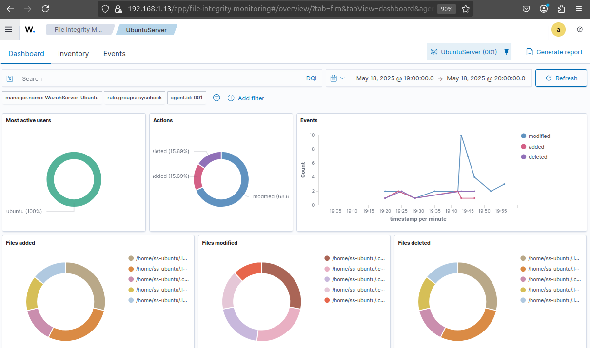
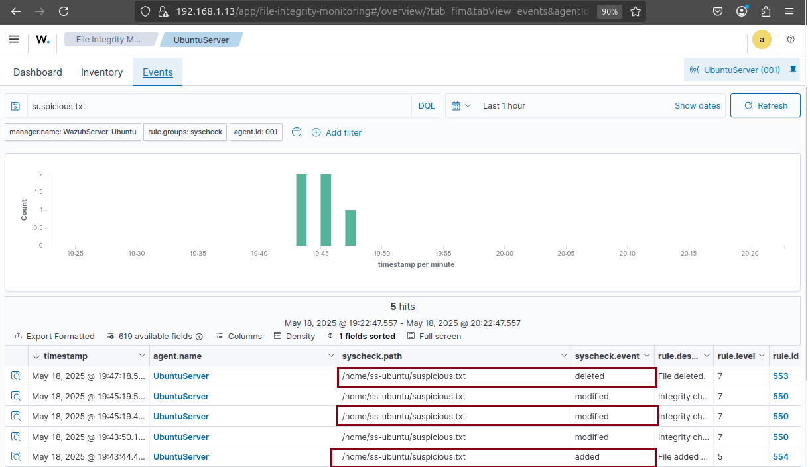

# 🛡️ Day 27 – EDR Basic: File Integrity Monitoring (FIM) with Wazuh
---

## Objective

Simulate unauthorized file changes on a Windows machine and detect them using **Wazuh File Integrity Monitoring (FIM)**. By configuring Wazuh to monitor specific directories, I learned how security teams use FIM to detect tampering, data modification, and suspicious file activity across endpoints.

## 🗂️ Table of Contents

- [Objective](#objective)
- [Lab Setup & Requirements](#lab-setup--requirements)
- [Step-by-Step Lab Instructions](#step-by-step-lab-instructions)
  - [Step 1: Configure File Integrity Monitoring (FIM) in Wazuh](#step-1-configure-file-integrity-monitoring-fim-in-wazuh)
  - [Step 2: Simulate Unauthorized File Changes (Attack Simulation)](#step-2-simulate-unauthorized-file-changes-attack-simulation)
  - [Step 3: Detect File Changes in Wazuh](#step-3-detect-file-changes-in-wazuh)
- [Submission Checklist](#submission-checklist)
- [Observation](#observation)
- [Conclusion](#conclusion)

---

## Lab Setup & Requirements

- **Wazuh Server**: Already installed and running 
- **Target Machine**: Windows with Wazuh Agent installed  
- **Access**: Administrator privileges on Windows, `sudo` access on the Wazuh Server

---

## Step-by-Step Lab Instructions

### Step 1: Configure File Integrity Monitoring (FIM) in Wazuh

1. On the **Wazuh Server**, open the main config file:
```bash
sudo nano /var/ossec/etc/ossec.conf
```

2. Add the following block under <ossec_config> to monitor a Windows directory:
``` xml
<syscheck>
    <frequency>600</frequency>
    <directories check_all="yes">C:\Users\Public\Documents</directories>
</syscheck>
```

3. Restart the Wazuh Manager service to apply the new FIM configuration:
```bash
sudo systemctl restart wazuh-manager
```

## Attack Simulation & Detection

### Step 2: Simulate Unauthorized File Changes (Attack Simulation)
1. Open PowerShell (Run as Administrator) on the Windows machine:

2. Create a sensitive file
```
echo "Sensitive data" > C:\Users\Public\Documents\important.txt
```
3. Modify it to simulate tampering
```
echo "Unauthorized modification detected" >> C:\Users\Public\Documents\important.txt
```

 4. Delete the file
 ```
Remove-Item C:\Users\Public\Documents\important.txt -Force
```

### Step 3: Detect File Changes in Wazuh
1. Log into the Wazuh Dashboard (https://<wazuh-server-ip>:5601)
2. Navigate to: Security Events → File Integrity Monitoring (FIM)
3. Run the following search query to filter relevant FIM logs:
```
rule.group:FIM AND data.win.eventdata.targetFilename:"C:\\Users\\Public\\Documents\\important.txt"
```
4. Look for events showing:

- 📄 File Created
- ✏️ File Modified
- ❌ File Deleted

## 📸 Submission Checklist
- ✅ Screenshot of Wazuh Dashboard showing file integrity alerts

### 📸 Screenshot - Wazuh Dashboard - File Integration Alerts
<p align="center">
  
</p>


- ✅ Screenshot of logs confirming file creation, modification, or deletion

### 📸 Screenshot - Wazuh - File Integration Management - Events
<p align="center">
  
</p>


- ✅ Brief observation on how FIM supports detection and forensic investigations

## Observation

File Integrity Monitoring (FIM) provides early warning signs of unauthorized access or data tampering. In this lab, simulating and detecting changes on a Windows endpoint demonstrated how Wazuh logs file activity and alerts analysts. This capability is critical for incident response, insider threat detection, and regulatory compliance.

## ✅ Conclusion
- ✅ Configured Wazuh to monitor sensitive Windows directories using FIM
- ✅ Simulated unauthorized file creation, modification, and deletion
- ✅ Verified that Wazuh detected the events via dashboard and logs
- ✅ Understood how SOC analysts leverage FIM to detect threats and maintain integrity

#
---

