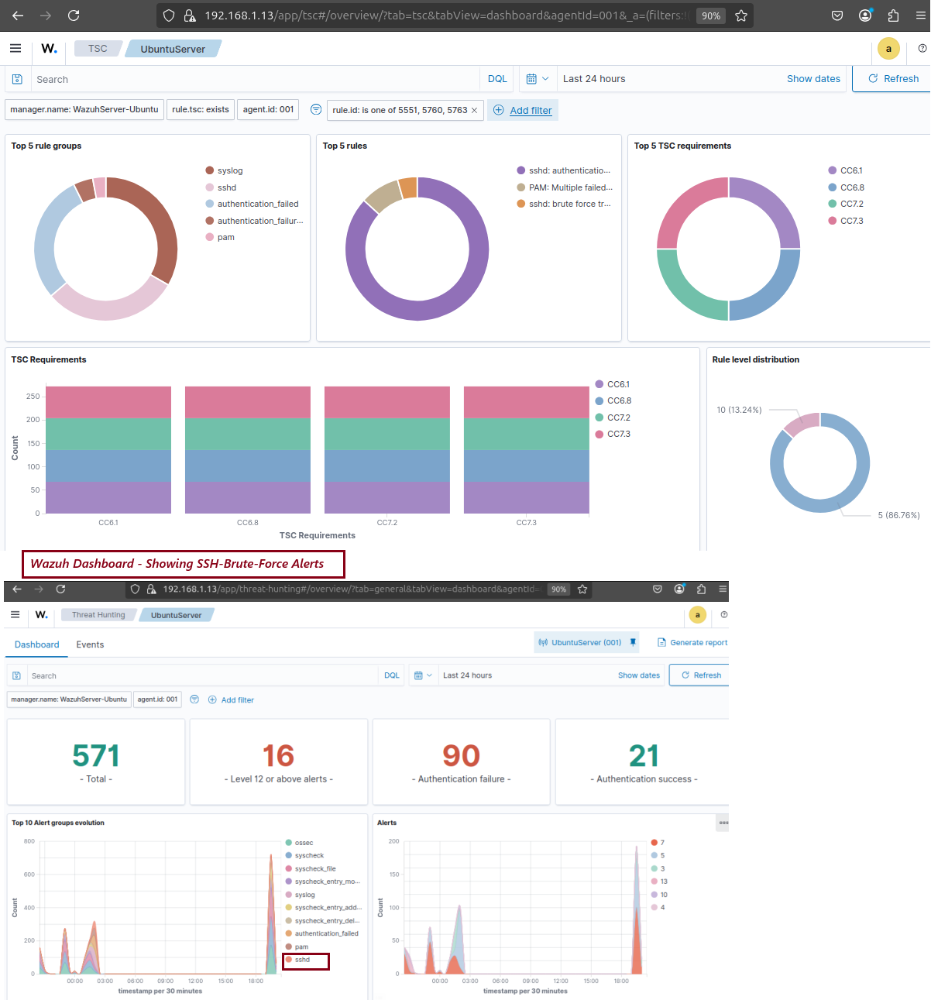
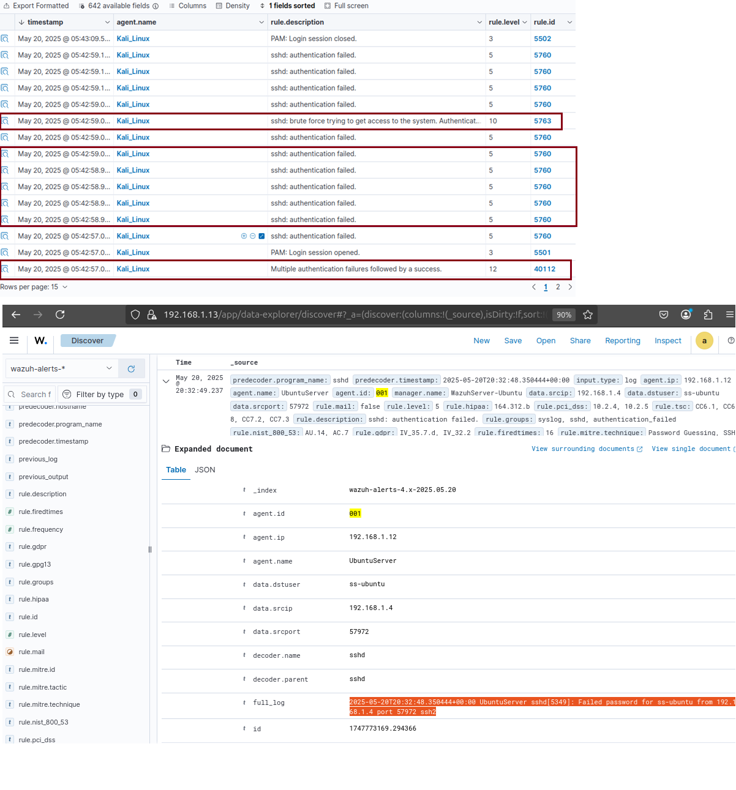

# 🛡️ Day 28 – EDR Basics: Detecting SSH Brute-Force Attacks with Wazuh

## Objective

Simulate an SSH brute-force attack on an Ubuntu machine and detect it using **Wazuh’s security monitoring capabilities**. And analyze Wazuh alerts to identify authentication anomalies and understand how EDR tools help detect credential-based attacks.

## 🗂️ Table of Contents

- [Objective](#objective)
- [Lab Setup & Requirements](#lab-setup--requirements)
- [Step-by-Step Lab Instructions](#step-by-step-lab-instructions)
  - [Step 1: Install Wazuh Agent on Ubuntu (Target)](#step-1-install-wazuh-agent-on-ubuntu-target)
  - [Step 2: Simulate an SSH Brute-Force Attack with Hydra](#step-2-simulate-an-ssh-brute-force-attack-with-hydra)
  - [Step 3: Detect Brute-Force in Wazuh Dashboard](#step-3-detect-brute-force-in-wazuh-dashboard)
- [Submission Checklist](#submission-checklist)
- [Observation](#observation)
- [Conclusion](#conclusion)


---

## Lab Setup & Requirements

- **Wazuh Server**: Installed and running (done on Day 26]  
- **Target Machine**: Ubuntu 22.04/20.04  
- **EDR Agent**: Wazuh Agent installed and running on the Ubuntu target  
- **Services**: SSH enabled on the target system  
- **Privileges**: `sudo` or root access required

---

## Step-by-Step Lab Instructions

### Step 1: Install Wazuh Agent on Ubuntu (Target)
- Install Wazuh Agent on 
```bash
curl -sO https://packages.wazuh.com/4.7/wazuh-agent-linux.sh && sudo bash wazuh-agent-linux.sh
```
- Edit the Wazuh Agent configuration file
```
sudo nano /var/ossec/etc/ossec.conf
```

- Update the <address> tag with your Wazuh Server IP:
```
<address>192.168.1.13</address>
```

- Restart the agent service
```
sudo systemctl restart wazuh-agent
```

 ### Step 2: Simulate an SSH Brute-Force Attack with Hydra
- On the attacker machine (can be another Linux VM or Kali):
```
sudo apt update && sudo apt install hydra -y
```

- Run the brute-force attack 
```
hydra -l ubuntu -P /usr/share/wordlists/rockyou.txt <target-IP> ssh
```
    - -l ubuntu: Specifies the username to attack

    - -P rockyou.txt: Uses a common password list
    - If successful, Hydra will show:
    ```
      [22][ssh] host: <192.168.1.4> login: ubuntu password: <password-123>
    ```

### Step 3: Detect Brute-Force in Wazuh Dashboard
- Log into the Wazuh dashboard: https://<wazuh-server-ip>:5601
- Navigate to Security Events
- Use the following query to filter SSH brute-force attempts:
```text
rule.id:(5551 OR 5712)
```
- Look for:
    - Repeated SSH login failures from the same IP
    - High-frequency failed authentications
    - Any successful login after brute-force attempts

---

## Submission Checklist
- ✅ Screenshot of Wazuh dashboard showing brute-force detection alerts
    ### 📸 Screenshot - Wazuh Dashboard showing SSH-Brute-Force Alerts
    <p align="center">
      
    </p>

- ✅ Screenshot of logs confirming multiple failed SSH login attempts
    ### 📸 Screenshot - Wazuh Alert Logs
    <p align="center">
      
    </p>

- ✅ Brief observation on the importance of SSH brute-force detection in SOC monitoring
    ## Observation
    SSH brute-force detection is critical for identifying unauthorized access attempts, especially against externally exposed servers. In this lab, simulating brute-force activity with Hydra and detecting it via Wazuh provided hands-on experience with authentication monitoring. These capabilities help SOC analysts identify attack patterns early and enforce defensive measures like IP blocking or MFA.

## Conclusion
- ✅ Installed and configured Wazuh Agent on an Ubuntu system
- ✅ Simulated a real-world SSH-brute-force attack using Hydra from Kali machine on Wazuh agent, the Linux machine
- ✅ Verified Wazuh's alerts detection these suspicious authentication attempts and analyzed the logs details
- ✅ Understood how EDR/SIEM tools are used in authentication threat detection and response