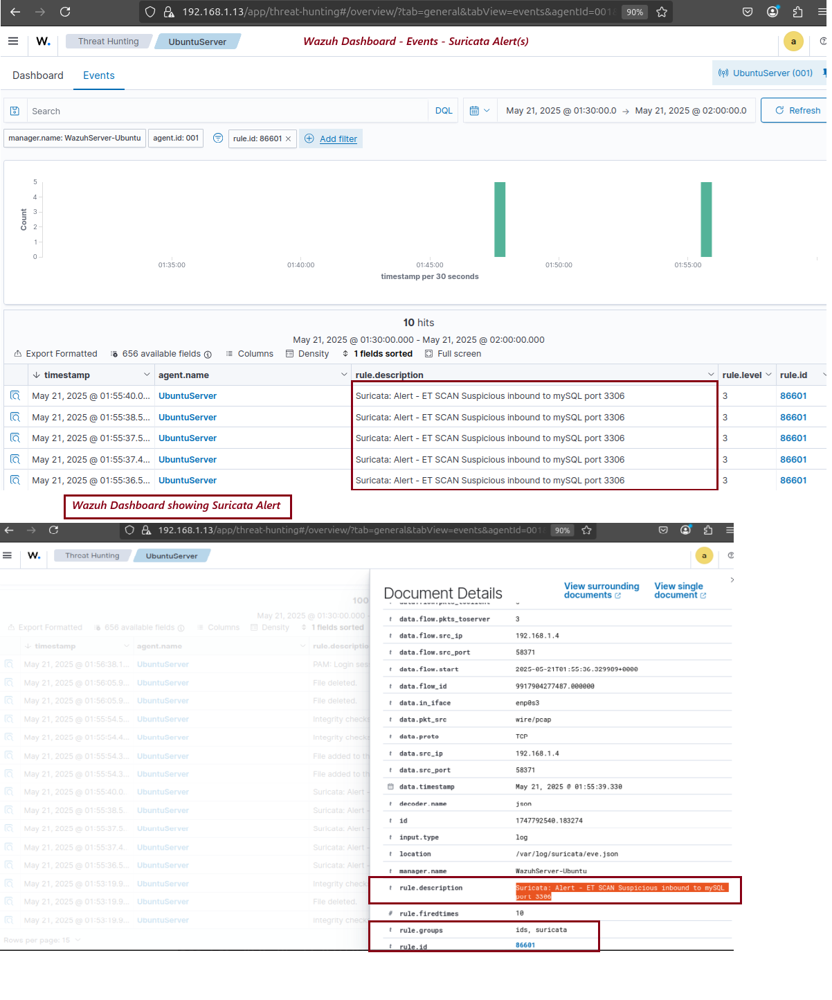

# 🛡️ Day 29 – EDR Basics: Detecting Suspicious Network Traffic with Suricata and Wazuh
---

## Objective

Learn how an Endpoint Detection and Response (EDR) solution like **Wazuh** can detect and visualize **suspicious network traffic** using the **Suricata** Intrusion Detection System (IDS). This lab simulates a port scanning attack using Nmap and captures detection events using Suricata rules integrated with Wazuh.

## 🗂️ Table of Contents

- [Objective](#objective)
- [What is Suspicious Network Traffic?](#what-is-suspicious-network-traffic)
- [Why Use Intrusion Detection Systems (IDS)?](#why-use-intrusion-detection-systems-ids)
- [How IDS Works](#how-ids-works)
- [What is Suricata?](#what-is-suricata)
- [Lab Setup](#lab-setup)
- [Task: Detect Port Scanning using Suricata + Wazuh](#task-detect-port-scanning-using-suricata--wazuh)
  - [Step 1: Install Suricata on the Agent](#step-1-install-suricata-on-the-agent)
  - [Step 2: Install Emerging Threats Rules](#step-2-install-emerging-threats-rules)
  - [Step 3: Configure Wazuh Agent to Read Suricata Logs](#step-3-configure-wazuh-agent-to-read-suricata-logs)
  - [Step 4: Simulate Attack from Kali Linux](#step-4-simulate-attack-from-kali-linux)
  - [Step 5: View Detection Alerts in Wazuh](#step-5-view-detection-alerts-in-wazuh)
- [Submission Checklist](#submission-checklist)
- [Learning Outcome](#learning-outcome)
- [Conclusion](#conclusion)

---

## What is Suspicious Network Traffic?

Suspicious network traffic refers to abnormal or potentially malicious activity across a network. Examples include:

- 🔍 Port scanning using tools like Nmap  
- ⚠️ Connections to known malicious IPs (Command & Control)  
- 📤 FTP uploads on non-standard ports  
- 🌐 HTTP connections to rare or suspicious domains  

---

## Why Use Intrusion Detection Systems (IDS)?

IDS like Suricata help detect:
- Network reconnaissance and probing  
- Lateral movement attempts  
- Malicious communication (e.g., malware callbacks)  
- Application-layer protocol anomalies

---

## How IDS Works

| Stage         | Description                                           |
|---------------|---------------------------------------------|
| **Packet Capture** | Intercepts packets on the network interface      |
| **Rule Matching**  | Compares traffic against known attack patterns  |
| **Alerting**    | Triggers log events when suspicious patterns are matched |
| **Integration**    | Sends events to SIEM platforms (e.g., Wazuh)   |

---

## What is Suricata?

**Suricata** is a powerful open-source IDS/IPS engine with features like:

- Deep packet inspection  
- Protocol identification (DNS, HTTP, TLS, etc.)  
- Multithreaded processing  
- JSON log output for integration  
- Emerging Threats rule sets  

---

## Lab Setup

| Component        | Description                               |
|------------------|-------------------------------------------|
| **Wazuh Server** | Ubuntu with Wazuh Manager & Dashboard     |
| **Wazuh Agent**  | Ubuntu with Suricata installed            |
| **Attacker**     | Kali Linux used to simulate port scanning |

---

## Task: Detect Port Scanning using Suricata + Wazuh

---

### Step 1: Install Suricata on the Agent
Install Suricata on the Ubuntu endpoint [ss-ubuntu]
```bash
sudo add-apt-repository ppa:oisf/suricata-stable
sudo apt-get update
sudo apt-get install suricata -y
```
### Step 2: Install Emerging Threat Rules
- Download and extract the Emerging Threats Suricata ruleset:
```bash
cd /tmp/
curl -LO https://rules.emergingthreats.net/open/suricata-6.0.8/emerging.rules.tar.gz
sudo tar -xvzf emerging.rules.tar.gz
sudo mkdir -p /etc/suricata/rules
sudo mv rules/*.rules /etc/suricata/rules/
sudo chmod 640 /etc/suricata/rules/*.rules
```
- Restart the Suricata service
```bash
sudo systemctl restart suricata
```

### Step 3: Configure Wazuh Agent to Read Suricata logs
1. Edit the config file on the Wazuh Agent
```bash
sudo nano /var/ossec/etc/ossec.conf
```
2. Add the following block inside <ossec_config> of the Wazuh agent. This allows the Wazuh agent to read the Suricata logs file
```xml
<localfile>
  <log_format>json</log_format>
  <location>/var/log/suricata/eve.json</location>
</localfile>
```
3. Restart the Wazuh Agent:
```
sudo systemctl restart wazuh-agent
```

### Step4: Simulate Attack from Kali Linux
On Kali Linux (ss-Kali) terminal, run a SYN scan:
```bash
nmap -sS -T4 <target-ip>
``` 
  - -sS: Performs a stealthy SYN scan
  - -T4: Sets aggressive timing for faster scan
This scan should trigger Suricata detection rules for port scanning.

### Step 5: View Detection Alerts in Wazuh
1. Log into the Wazuh Dashboard (https://<192.168.1.13:5601)
2. Navigate to Security Events 
3. Choose the agent that runs Suricata
4. Filter logs using this query (Rule Group: Suricata):

```plaintext
rule.group:suricata
```
5. Look for:

    - 🛑 ET SCAN Nmap Synchronous Scan
    - 🚨 Other alerts triggered by network scan behavior

## Submission Checklist
- ✅ Screenshot of Suricata service running (systemctl status suricata)
### 📸 Screenshot - Wazuh Agent with Suricata Service running
<p align="center">
  
</p>

- ✅ Screenshot of Wazuh dashboard showing Suricata-tagged alerts
### 📸 Screenshot - Wazuh Dashboard showing Suricata-tagged Alerts
<p align="center">
  
</p>

- ✅ Brief observation on the value of network traffic detection in EDR
 ### Observation
Network traffic detection is a critical layer in any Endpoint Detection and Response (EDR) strategy. While traditional EDR tools monitor host activity (processes, file access, registry changes), integrating network-based detection through tools like Suricata enables broader visibility into how endpoints communicate.

By capturing signs of reconnaissance (e.g., Nmap scans), lateral movement, or suspicious outbound connections, analysts can detect attacks in their early stages — before malware is even executed. This enhances both detection depth and response readiness in SOC environments.

## Learning Outcome
By completing this lab, I learned how to:
- ✅ Install and configure Suricata IDS on a monitored endpoint
- ✅ Integrate Suricata logs into Wazuh for real-time alerting
- ✅ Detect and analyze a port scanning attack using Nmap
- ✅ Gain practical exposure to how IDS complements EDR/SIEM capabilities
- 

## ✅ Conclusion
This exercise demonstrated how network-based attack detection using Suricata enhances endpoint visibility. By capturing and analyzing suspicious traffic patterns, SOC teams can act early in the kill chain to prevent further compromise.

---


