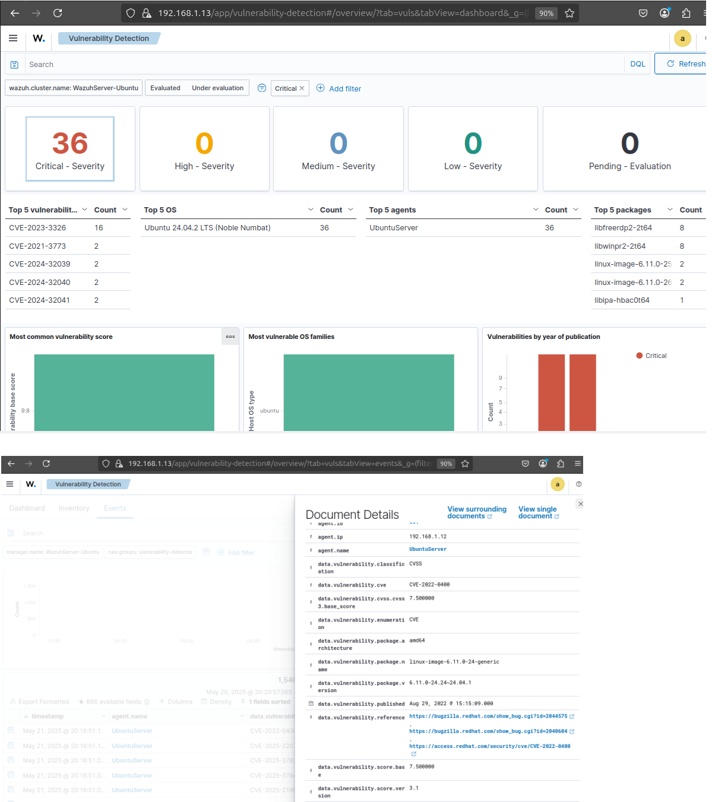

# 🛡️ Day 30 – EDR Basics: Vulnerability Detection using Wazuh

## Objective

To detect vulnerabilities in an endpoint system using **Wazuh’s built-in Vulnerability Detection module**, and to learn how SOC analysts identify, prioritize, and mitigate those vulnerabilities using CVE data and threat context.

## 🗂️ Table of Contents

- [Objective](#objective)
- [What is a Vulnerability?](#what-is-a-vulnerability)
- [Types of Vulnerabilities](#types-of-vulnerabilities)
- [How Are Vulnerabilities Discovered?](#how-are-vulnerabilities-discovered)
- [How SOC Analysts Mitigate Vulnerabilities](#how-soc-analysts-mitigate-vulnerabilities)
- [Lab Setup](#lab-setup)
- [Task: Detecting and Visualizing Vulnerabilities using Wazuh](#task-detecting-and-visualizing-vulnerabilities-using-wazuh)
  - [Step 1: Enable Vulnerability Detection on Wazuh Server](#step-1-enable-vulnerability-detection-on-wazuh-server)
  - [Step 2: View Vulnerability Alerts in the Wazuh Dashboard](#step-2-view-vulnerability-alerts-in-the-wazuh-dashboard)
- [Submission Checklist](#submission-checklist)
- [Learning Outcome](#learning-outcome)
- [Conclusion](#conclusion)


---

## What is a Vulnerability?

A **vulnerability** is a flaw or weakness in software, configuration, or hardware that could be exploited to perform unauthorized actions, escalate privileges, or compromise system integrity.

---

## Types of Vulnerabilities

| Type               | Example                               |
|--------------------|----------------------------------------|
| **Software Bugs**  | Buffer overflow in Apache              |
| **Misconfigurations** | SSH root login enabled            |
| **Outdated Software** | Unpatched Linux or Windows packages |
| **Default Credentials** | admin:admin on web interfaces   |
| **Open Ports/Services** | FTP open with anonymous login  |

---

## How Are Vulnerabilities Discovered?

- 🔬 Vulnerability Scanners (e.g., **OpenVAS**, **Nessus**, **Wazuh**)
- 🌐 Threat Intelligence Feeds
- 💻 Manual or Penetration Testing
- 🪲 Bug Bounty Programs
- 📚 CVE Databases (e.g., **NVD**, **Exploit-DB**, Canonical Tracker)

---

## How SOC Analysts Mitigate Vulnerabilities

- 🧮 Prioritize based on **CVSS score** and asset importance
- 🩹 Apply **patches or updates**
- 🔒 Disable or restrict vulnerable services
- 🔎 Monitor for exploitation via IDS/EDR/SIEM
- 🧾 Document and track through ticketing systems (e.g., Jira, ServiceNow)

---

## Lab Setup

| Component        | Description                             |
|------------------|------------------------------------------|
| **Wazuh Server** | Ubuntu system with Wazuh Manager & Dashboard |
| **Wazuh Agent**  | Ubuntu machine with agent installed      |

---

## Task: Detecting and Visualizing Vulnerabilities using Wazuh

### Step 1: Enable Vulnerability Detection on Wazuh Server

- Edit the Wazuh manager configuration:

```bash
sudo nano /var/ossec/etc/ossec.conf
```

- Add or modify the <vulnerability-detector> section:
```xml
<vulnerability-detector>
  <enabled>yes</enabled>
  <interval>12h</interval>
  <providers>
    <provider name="canonical">yes</provider>
  </providers>
</vulnerability-detector>
```
- Restart the Wazuh Manager
```
sudo systemctl restart wazuh-manager
```
- Wazuh Agent will now scan installed packages and correlate them with known CVEs from NVD or Canonical Security Tracker.

### Step 2: View Vulnerability Alerts in the Wazuh Dashboard
- Access the Wazuh dashboard: https://<wazuh-server-ip>:5601
- Go to Security Events → Rule Groups → vulnerability-detector
- Use a filter like:
```plaintext
rule.groups: "vulnerability-detector" AND rule.level >= 10
```
- Review alert fields:
  - CVE ID (e.g., CVE-2023-XXXX)
  - Affected package (e.g., libssl1.1)
  - Severity / CVSS score
  - Mitigation recommendations


### Submission Checklist
- ✅ Screenshot of Wazuh dashboard showing at least one CVE alert
    ## 📸 Screenshot - Wazuh Dashboard showing CVE alert
    <p align="center">
     
    </p>

- ✅ Description of affected package, CVE ID, and CVSS score
      - Package Affected: Cryptography (pip) - Vulnerable OpenSSL included    in cryptography wheels
      - Versions Affected: >= 42.0.0, < 44.0.1
      - CVE: CVE-2024-12797
      - Description:
      Issue summary: Clients using RFC7250 Raw Public Keys (RPKs) to authenticate a server may fail to notice that the server was not authenticated, because handshakes don't abort as expected when the SSL_VERIFY_PEER verification mode is set.
      Impact summary: TLS and DTLS connections using raw public keys may be
      vulnerable to man-in-middle attacks when server authentication failure is not detected by clients.
      - CVSS Score: 6.3

- ✅ Suggested mitigation step (e.g., update package)
      - Remediation: Patch with version 44.0.1

### Learning Outcome
By completing this lab, you learned how to:
  - ✅ Enable and configure Wazuh’s Vulnerability Detector
  - ✅ Visualize high-risk CVEs through the Wazuh dashboard
  - ✅ Understand how vulnerabilities are discovered and ranked
  - ✅ Simulate the workflow of a SOC Analyst triaging vulnerabilities


### Conclusion
This exercise demonstrated how Wazuh helps identify vulnerable software packages in real time. Using CVE data and severity scores, SOC analysts can take a proactive approach to system hardening and reduce the attack surface. Vulnerability detection and timely remediation are critical pillars of a strong EDR strategy.

---


